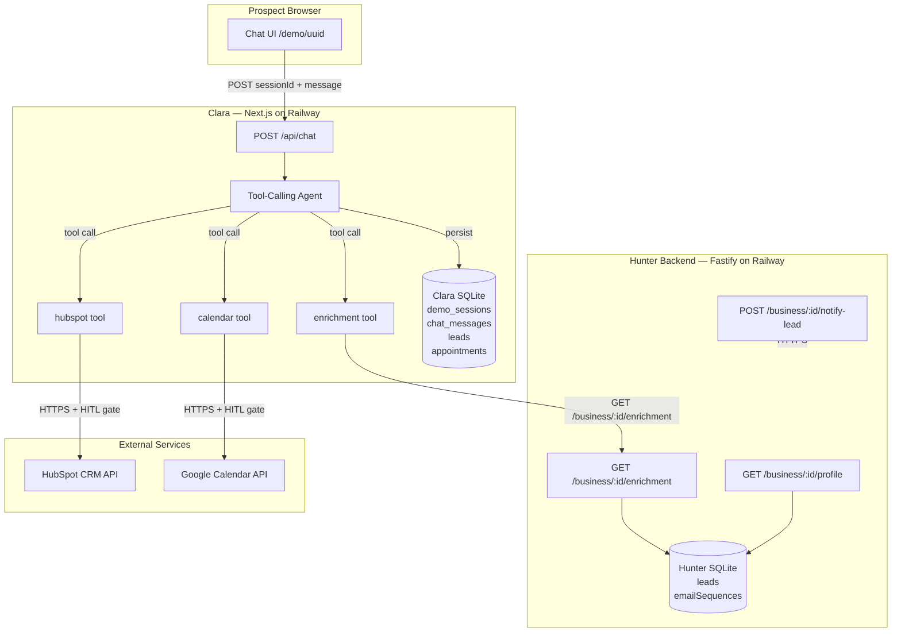

# Clara Tool Integration & Agent-Core Architecture
**Product:** Clara (AI Receptionist) — Tool-Calling Upgrade
**Architect:** Architect Agent
**Date:** 2026-03-24
**Scope:** `Clara/`, `packages/agent-core/`, and new Hunter API endpoints
**Phase target:** Clara Explore → Iterate

---

## 1. System Overview



---

## 2. ADR-0010 Reactivation: Why packages/agent-core/ Is Justified Now

ADR-0010 (2026-03-22) deleted the `packages/` directory because it had zero real consumers
and three speculative packages with no imports. That decision was correct at the time.

This architecture explicitly supersedes the agent-core prohibition from ADR-0010 for the
following reason: the trigger condition from ADR-0010 is now satisfied.

> "The correct trigger for reintroducing shared packages is: two or more projects
> independently defining the same type. That has not occurred." — ADR-0010

As of this architecture:
- Veya (`veya/src/services/hubspot.js`) defines HubSpot contact create/search/update
- Clara would independently define the same operations if not extracted
- The HubSpot association type IDs (202 notes, 204 tasks, 194 calls) are business constants
  that must not be duplicated across two callsites

This is not speculative. Clara needs these exact capabilities now. The package has real
consumers from day one of its creation.

A new ADR (ADR-0014) formalizes this re-introduction.

---

## 3. Tech Stack Decisions

| Layer | Choice | Rationale | Rejected Alternatives |
|-------|--------|-----------|----------------------|
| Shared package | `packages/agent-core/` TypeScript, published as local workspace package | Both Clara and Hunter are TS. Veya is JS but will consume via dynamic require or type-only imports if needed at all. Local workspace avoids npm publishing complexity | npm-published package (premature), copy-paste (drift risk), API-proxy-only (loses type safety) |
| Clara agent framework | LangChain `createToolCallingAgent` + `AgentExecutor` | Clara already uses LangChain and Groq. Upgrading to LangGraph would add significant complexity for a chat agent with 4 tools. LangChain's tool-calling abstraction is sufficient and testable | Full LangGraph migration (over-engineered for this use case), custom tool loop (reinventing LangChain) |
| Clara LLM | Groq `llama-3.3-70b-versatile` (pinned) | Existing, free-tier, fast. Supports tool calling. | GPT-4o (cost), Claude Haiku (no Groq integration to rip out) |
| HubSpot writes | Clara calls HubSpot directly with its own `HUBSPOT_ACCESS_TOKEN` | Avoids routing PII through Hunter. Each service owns its own CRM token with minimum required scopes. Hunter already does its own HubSpot writes via a separate gate | Hunter proxies HubSpot writes (couples two services on the write path, Hunter becomes a bottleneck, single point of auth failure) |
| Calendar | Same Google Calendar as Veya, same service account | Single calendar per business. Operator controls one calendar. Clara books into it. Using a separate calendar would split the operator's availability view | Separate Clara calendar (operator has to manage two calendars, double-booking risk between voice and chat), Calendly (unnecessary vendor dependency) |
| Enrichment access | Hunter API call at session start, cached in `demo_sessions` table | Already working. Profile is fetched once, cached. | Hunter pushes enrichment into Clara DB (push model requires webhook infra, adds coupling), Clara queries Hunter DB directly (breaks service isolation) |
| Clara DB | Add `appointments` table to existing SQLite | No reason to change database. Adding one table. | Separate DB for appointments (unnecessary), PostgreSQL (no need at this scale) |
| HITL gates | New env vars `CLARA_CONFIRM_HUBSPOT_WRITE` and `CLARA_CONFIRM_BOOKING` | Follows established factory pattern exactly. Separate vars for separate action types | Single `CLARA_CONFIRM_ALL` var (too coarse, violates HITL registry pattern) |
| Test isolation | `SIMULATE_APIS=true` env var pattern from Veya, adapted to TS | Veya's pattern is proven across 1683 tests. Direct port to TS. | HTTP interceptors (nock) — more fragile, coupled to request library |

---

## 4. Package Structure

### 4.1 New Directory: `packages/agent-core/`

This package is a local TypeScript workspace package consumed by Clara via `npm link` or
workspace protocol. It is NOT published to npm.

```
packages/
└── agent-core/
    ├── package.json          # name: "@agenticlearning/agent-core", private: true
    ├── tsconfig.json         # strict: true, target: ES2022, module: ESNext
    ├── vitest.config.ts      # coverage thresholds: lines 80%, branches 70%
    ├── src/
    │   ├── index.ts          # barrel export
    │   ├── hubspot/
    │   │   ├── client.ts     # HubSpot API client factory (lazy singleton)
    │   │   ├── contacts.ts   # searchContactByEmail, createContact, updateContact
    │   │   ├── notes.ts      # createNoteOnContact (association type 202)
    │   │   ├── tasks.ts      # createTask (association type 204)
    │   │   └── types.ts      # HubSpotContact, HubSpotNote, HubSpotTask types
    │   ├── calendar/
    │   │   ├── client.ts     # Google Calendar JWT auth factory
    │   │   ├── slots.ts      # getAvailableSlots, isSlotBusy
    │   │   ├── booking.ts    # bookSlot, rescheduleSlot, cancelSlot
    │   │   └── types.ts      # CalendarSlot, BookingResult types
    │   ├── simulation/
    │   │   ├── index.ts      # isSimulating() — reads SIMULATE_APIS env var
    │   │   ├── hubspot-sim.ts # MOCK_CONTACTS, simulated HubSpot responses
    │   │   └── calendar-sim.ts # getMockSlots(), simulated booking responses
    │   └── retry/
    │       └── index.ts      # withRetry() — exponential backoff, port from veya
    └── __tests__/
        ├── hubspot.test.ts
        ├── calendar.test.ts
        └── simulation.test.ts
```

### What stays in each project

**Clara (keeps):**
- `src/agent/receptionist.ts` — refactored to be the tool-calling agent host
- `src/agent/tools/` (new) — Clara-specific tool wrappers that call agent-core
- `src/agent/tools/book-appointment.ts` — wraps `agent-core/calendar/booking.ts` + HITL gate
- `src/agent/tools/capture-lead.ts` — wraps `agent-core/hubspot/contacts.ts` + HITL gate
- `src/agent/tools/get-available-slots.ts` — wraps `agent-core/calendar/slots.ts`
- `src/agent/tools/get-enrichment.ts` — calls Hunter API (not via agent-core)
- `src/db/schema.ts` — add `appointments` table

**Hunter (keeps):**
- All existing agent nodes, tools, services
- New route: `GET /business/:id/enrichment` (extended profile for tool use)
- New route: `POST /business/:id/notify-lead` (Clara notifies Hunter when lead captured)

**Veya (unchanged):**
- Continues using its own `src/services/hubspot.js` and `src/services/calendar.js`
- No migration of Veya code to agent-core in this sprint (Veya is Live phase — migration
  is a separate ADR-gated decision)

### 4.2 Why Veya Is Not Migrated

Veya is JavaScript (ES Modules). Agent-core is TypeScript. Migrating Veya to consume
agent-core requires either:
- Shipping agent-core compiled to CJS/ESM with type declaration files (build complexity)
- Rewriting Veya's services in TypeScript (massive blast radius on a Live system)

Neither is appropriate in this sprint. Veya's implementations are reference implementations
that agent-core ports to TypeScript. Veya diverges in the future when it is ready.

---

## 5. Data Flow Diagrams

### 5.1 Enrichment Flow (Unchanged, clarified)

```
Hunter draftEmails.ts
  └─ POST ${CLARA_URL}/api/demo { hubspot_company_id }
       └─ Clara: creates demo_sessions row
            └─ Returns { sessionId, uuid }

Prospect visits /demo/{uuid}
  └─ First POST /api/chat { sessionId, message }
       └─ Clara agent fetches: GET ${HUNTER_API_URL}/business/{id}/profile
            └─ Caches businessName in demo_sessions.business_name
```

This flow is unchanged. On subsequent messages, the cached `businessName` is used and the
full enrichment profile is fetched fresh per-session (already implemented, no change needed).

### 5.2 Lead Capture Flow (New — HubSpot write)

```
Prospect: "I'd like someone to follow up with me"
  └─ Clara agent detects intent → calls capture_lead tool
       └─ [HITL gate: CLARA_CONFIRM_HUBSPOT_WRITE === 'true']
            └─ agent-core: searchContactByEmail(email)
                 ├─ Found → updateContact(contactId, { note: "Clara demo inquiry" })
                 └─ Not found → createContact({ firstname, lastname, email, phone })
            └─ agent-core: createNoteOnContact(contactId, "Demo conversation summary")
            └─ Clara DB: INSERT INTO leads (sessionId, hubspot_company_id, name, contact)
            └─ Clara: POST ${HUNTER_API_URL}/business/:id/notify-lead
                  └─ Hunter: marks lead status = 'demo_engaged' in leads table
```

### 5.3 Appointment Booking Flow (New — Google Calendar write)

```
Prospect: "Can I book a time this week?"
  └─ Clara agent → calls get_available_slots tool
       └─ agent-core: getAvailableSlots() → returns [{start, end, label}...]
       └─ Clara returns slot options as text: "I have Tuesday 2pm or Wednesday 10am"

Prospect: "Tuesday 2pm works"
  └─ Clara agent → calls book_appointment tool
       └─ [HITL gate: CLARA_CONFIRM_BOOKING === 'true']
            └─ agent-core: bookSlot({ sessionId, start, end, attendeeEmail, attendeeName })
            └─ Clara DB: INSERT INTO appointments (sessionId, eventId, start, end, attendeeEmail)
            └─ agent-core: createTask on HubSpot contact (if contact exists)
                  └─ [HITL gate: CLARA_CONFIRM_HUBSPOT_WRITE === 'true']
```

---

## 6. New Hunter API Endpoints

Two new endpoints on Hunter backend:

### 6.1 GET /business/:hubspotCompanyId/enrichment

Extended profile for tool use. Returns everything the basic `/profile` endpoint returns,
plus additional fields Clara's tools need.

```typescript
// Response shape
interface ExtendedBusinessProfile extends BusinessProfile {
  googleCalendarId: string | null  // which calendar to book into
  hubspotOwnerId: string | null    // which HubSpot owner to assign new contacts to
  timezone: string                 // IANA timezone string, e.g. "America/Chicago"
  bookingDurationMinutes: number   // default 30, operator-configurable
  industry: string | null          // already in base profile, ensured here
}
```

Auth: same `HUNTER_API_KEY` Bearer token pattern as `/profile`.

Rationale: rather than Clara storing calendar config, Hunter is the source of truth for
all business configuration. Clara asks Hunter which calendar to use for this company.

### 6.2 POST /business/:hubspotCompanyId/notify-lead

Signals to Hunter that a Clara session produced an engaged lead.

```typescript
// Request body
interface NotifyLeadRequest {
  sessionId: string        // Clara's demo_sessions UUID
  name: string             // Prospect name
  contact: string          // Email or phone
  message?: string         // Optional note from prospect
  hubspotContactId?: string // If Clara already wrote the contact to HubSpot
}

// Response
interface NotifyLeadResponse {
  acknowledged: true
  leadId?: string          // Hunter's internal lead ID if found/created
}
```

Hunter behavior on receiving this:
- Looks up `lead` by `hubspot_company_id`
- Updates `leads.status` to `'demo_engaged'` if not already further in pipeline
- Updates `leads.lastContactedAt`
- Does NOT create a new lead row (prospect is not the same entity as the lead being sold to)

Auth: same `HUNTER_API_KEY` Bearer token.

---

## 7. Clara Agent Upgrade: LangChain to Tool-Calling

### Current Architecture

`receptionist.ts` uses `llm.invoke(messages)` — raw LLM call, no tools.

### Target Architecture

`receptionist.ts` becomes a tool-calling agent using LangChain's `createToolCallingAgent`:

```typescript
// Clara/src/agent/receptionist.ts (refactored structure — types only shown)
import { createToolCallingAgent, AgentExecutor } from 'langchain/agents'
import { ChatPromptTemplate } from '@langchain/core/prompts'
import { bookAppointmentTool } from './tools/book-appointment'
import { captureLeadTool } from './tools/capture-lead'
import { getAvailableSlotsTool } from './tools/get-available-slots'
import { getEnrichmentTool } from './tools/get-enrichment'

// Tools are instantiated with config at agent construction time
// Config includes: simulate flag, HITL gate status, calendar ID, HubSpot token
const tools = [
  getAvailableSlotsTool(config),
  bookAppointmentTool(config),
  captureLeadTool(config),
  getEnrichmentTool(config),
]

const agent = createToolCallingAgent({ llm, tools, prompt })
const executor = new AgentExecutor({ agent, tools, maxIterations: 5 })
```

### Why Not LangGraph

LangGraph's value is in branching, cycles, and stateful multi-agent coordination. Clara's
conversation is a linear chat loop: user sends message → agent may call 0-2 tools → agent
responds. There is no branching logic that requires a graph. LangGraph would add:

- A graph definition file
- State reducers
- Node functions
- Conditional edges

For a 4-tool chat agent, this is 4x the code with no behavioral benefit. LangChain's
`AgentExecutor` handles exactly this pattern and is directly testable.

Revisit trigger: if Clara needs multi-step agentic flows (e.g., look up contact → decide
whether to update or create → notify Hunter → update calendar) that exceed 3 sequential tool
calls with conditional logic.

### Tool Definitions for LLM Function Calling

```typescript
// packages/agent-core/src/tools/schemas.ts — Zod schemas double as JSON schema for LLM

export const GetAvailableSlotsSchema = z.object({})  // no parameters
export const GetAvailableSlotsOutputSchema = z.object({
  slots: z.array(z.object({
    start: z.string(),   // ISO datetime
    end: z.string(),     // ISO datetime
    label: z.string(),   // "Tuesday, March 26 at 2:00 PM"
  })),
})

export const BookAppointmentSchema = z.object({
  start: z.string().describe('ISO datetime of selected slot start'),
  end: z.string().describe('ISO datetime of selected slot end'),
  attendeeName: z.string().describe('Prospect full name'),
  attendeeEmail: z.string().email().describe('Prospect email address'),
  notes: z.string().optional().describe('Any additional context'),
})
export const BookAppointmentOutputSchema = z.object({
  success: z.boolean(),
  eventId: z.string().optional(),
  confirmationMessage: z.string(),  // Human-readable for inclusion in reply
})

export const CaptureLeadSchema = z.object({
  name: z.string().describe('Prospect full name'),
  contact: z.string().describe('Prospect email or phone number'),
  message: z.string().optional().describe('What the prospect is looking for'),
})
export const CaptureLeadOutputSchema = z.object({
  success: z.boolean(),
  hubspotContactId: z.string().optional(),
  confirmationMessage: z.string(),
})

export const GetEnrichmentSchema = z.object({})  // enrichment fetched for current session
export const GetEnrichmentOutputSchema = z.object({
  availableSlotCount: z.number(),
  timezone: z.string(),
  bookingDurationMinutes: z.number(),
})
```

---

## 8. Clara DB Schema Addition

New `appointments` table in `Clara/src/db/schema.ts`:

```typescript
export const appointments = sqliteTable('appointments', {
  id:               text('id').primaryKey(),
  sessionId:        text('session_id').notNull().references(() => demoSessions.id),
  hubspotCompanyId: text('hubspot_company_id').notNull(),
  googleEventId:    text('google_event_id'),    // null if SIMULATE_APIS=true
  attendeeEmail:    text('attendee_email').notNull(),
  attendeeName:     text('attendee_name').notNull(),
  start:            text('start').notNull(),     // ISO datetime
  end:              text('end').notNull(),        // ISO datetime
  status:           text('status', { enum: ['scheduled', 'cancelled', 'rescheduled'] })
                    .notNull().default('scheduled'),
  createdAt:        text('created_at').notNull().$defaultFn(() => new Date().toISOString()),
  cancelledAt:      text('cancelled_at'),
})
```

This table links back to `demo_sessions` (for session context) and stores the Google Calendar
event ID for future reschedule/cancel operations. `hubspotCompanyId` is denormalized for
tenant-scoped queries (same pattern as `leads` table).

---

## 9. HITL Gate Registry — New Entries for Clara

Following the exact-string comparison requirement from `.claude/rules/hitl-gate-exact-string.md`:

| Variable | Action | Tier | Default | When to set true |
|----------|--------|------|---------|-----------------|
| `CLARA_CONFIRM_HUBSPOT_WRITE` | Create or update HubSpot contact from Clara session | Tier 2 | `false` | When operator has reviewed Clara demo output and trusts contact quality |
| `CLARA_CONFIRM_BOOKING` | Create Google Calendar event from Clara session | Tier 3 | `false` | When operator confirms Clara calendar is correctly configured and service account authorized |

Implementation pattern (must follow exact-string rule):

```typescript
// Clara/src/agent/tools/book-appointment.ts
if (process.env.SIMULATE_APIS === 'true') {
  return simulatedBookingResult  // FIRST — always
}
if (process.env.CLARA_CONFIRM_BOOKING !== 'true') {
  throw new Error('Calendar booking blocked: set CLARA_CONFIRM_BOOKING=true to enable (Tier 3 HITL gate)')
}
// real booking call — THIRD
```

These variables must be added to:
- `Clara/.env.example` (commented out, value `false`)
- `.claude/rules/hitl-gate-exact-string.md` HITL registry table (new rows)
- Clara's CLAUDE.md HITL Gates section

---

## 10. Environment Variables — Clara (additions)

```bash
# ─── HubSpot (new — required when CLARA_CONFIRM_HUBSPOT_WRITE=true) ────────────
HUBSPOT_ACCESS_TOKEN=REPLACE_ME_hubspot_private_app_token

# ─── Google Calendar (new — required when CLARA_CONFIRM_BOOKING=true) ──────────
GOOGLE_SERVICE_ACCOUNT_KEY_PATH=/path/to/service-account.json
# OR inline JSON (Railway preferred — no file mount needed):
GOOGLE_SERVICE_ACCOUNT_KEY_JSON={"type":"service_account",...}
GOOGLE_CALENDAR_ID=primary
BUSINESS_TIMEZONE=America/Chicago

# ─── HITL Gates (new) ──────────────────────────────────────────────────────────
CLARA_CONFIRM_HUBSPOT_WRITE=false
CLARA_CONFIRM_BOOKING=false

# ─── Simulation (existing pattern, document explicitly) ────────────────────────
SIMULATE_APIS=false
# Set to true in test environments — bypasses all external API calls
```

---

## 11. Security Architecture

### Authentication Model

- Operator actions (POST /api/demo, GET /api/leads, admin endpoints): Bearer token via
  `CLARA_OPERATOR_API_KEY` — existing, unchanged
- Visitor chat (POST /api/chat): UUID-as-capability — existing, unchanged
- Hunter → Clara call: Clara's `/api/demo` endpoint requires `CLARA_OPERATOR_API_KEY`
  which Hunter holds as `CLARA_OPERATOR_API_KEY` env var on its side
- Clara → Hunter call: Bearer `HUNTER_API_KEY` — existing, unchanged
- Clara → HubSpot: Private App token (`HUBSPOT_ACCESS_TOKEN`) — never exposed to frontend

### Authorization Model

Clara holds its own HubSpot Private App token with minimum required scopes:
- `crm.objects.contacts.read` — for searchContactByEmail
- `crm.objects.contacts.write` — for createContact, updateContact
- `crm.objects.notes.write` — for createNoteOnContact
- `crm.objects.tasks.write` — for createTask

This token is distinct from Hunter's HubSpot token. This follows least-privilege: Clara
cannot read Hunter's leads or delete contacts.

### Trust Boundaries

- Clara's chat endpoint trusts the `sessionId` UUID as an opaque capability — valid UUIDs
  that exist in `demo_sessions` and are not soft-deleted are trusted
- Clara does NOT trust prospect-supplied name/contact data for HubSpot writes without
  HITL gate enabled — the gate is the human confirmation layer
- `agent-core` functions receive already-validated data — validation happens in Clara's
  route layer before tool invocation

### Data Classification

| Data | Classification | Protection |
|------|---------------|------------|
| Prospect name + email from chat | PII | Never logged; HITL gate before CRM write |
| Chat transcripts | Sensitive | Stored in SQLite, not transmitted except to LangSmith when tracing enabled |
| HubSpot access token | Secret | Env var only, never in code |
| Google service account key | Secret | File path or inline JSON env var; never committed |
| Session UUIDs | Internal | URL-safe, not secret — security via obscurity is insufficient alone |

### Compliance

- GDPR Art.17 right-to-erasure: Clara already has `DELETE /api/leads/:id` (hard delete).
  With HubSpot writes enabled, a new `CLARA_CONFIRM_GDPR_ERASE` gate must be added before
  GA (tracked in the HITL registry, not in scope for this sprint)
- LangSmith: when `LANGSMITH_TRACING=true`, chat content including prospect PII flows to
  LangSmith. The ROPA must list LangSmith as a third-party processor before Clara goes Live

---

## 12. Infrastructure Plan

### Environments

| Environment | Clara URL | Hunter URL | Notes |
|-------------|-----------|------------|-------|
| Local dev | localhost:3002 | localhost:3001 | SIMULATE_APIS=true; no real APIs |
| Staging | Railway staging service | Railway staging service | HITL gates off; SIMULATE_APIS=false allowed for integration smoke test |
| Production | Railway production service | Railway production service | HITL gates operator-controlled |

### CI/CD

Clara CI (`.github/workflows/clara-ci.yml` — to be created as part of Iterate promotion):
- On PR: `npm run test`, `npm run typecheck`
- Coverage threshold: lines 70%, functions 70%, branches 60%
- Must pass before merge

Agent-core CI (`.github/workflows/agent-core-ci.yml`):
- On PR touching `packages/agent-core/`: run agent-core tests
- Coverage threshold: lines 80%, branches 70% (Control-grade coverage — this is shared infra)

### Environment Variables — Categories

| Category | Variables | Notes |
|----------|-----------|-------|
| LLM | `GROQ_API_KEY`, `GROQ_MODEL` | Existing |
| Observability | `LANGSMITH_API_KEY`, `LANGSMITH_TRACING`, `LANGSMITH_PROJECT` | Existing; required at Live |
| Hunter integration | `HUNTER_API_URL`, `HUNTER_API_KEY` | Existing |
| Operator auth | `CLARA_OPERATOR_API_KEY` | Existing |
| HubSpot (new) | `HUBSPOT_ACCESS_TOKEN` | New |
| Google Calendar (new) | `GOOGLE_SERVICE_ACCOUNT_KEY_JSON`, `GOOGLE_CALENDAR_ID`, `BUSINESS_TIMEZONE` | New |
| HITL gates (new) | `CLARA_CONFIRM_HUBSPOT_WRITE`, `CLARA_CONFIRM_BOOKING` | New |
| Simulation | `SIMULATE_APIS` | New (documented explicitly) |
| DB | `DATABASE_PATH` | Existing |
| App | `PORT`, `NODE_ENV`, `NEXT_PUBLIC_BASE_URL` | Existing |

### Backup and Recovery

- Clara SQLite: Railway persistent volume, same strategy as Hunter (Railway volume snapshots)
- `appointments` table data: Google Calendar is the authoritative record; SQLite is a local
  index. Loss of the table is recoverable by re-syncing from Google Calendar API
- `leads` table: hard deletes are permanent (GDPR requirement); no backup of deleted rows

### Monitoring and Alerting

- LangSmith: agent traces for all chat interactions (required before Live phase)
- Existing email notification: operator gets email on new lead capture (Clara already has nodemailer)
- No new monitoring infrastructure needed for Iterate phase

---

## 13. Scalability and Performance Notes

### Current Design Capacity

- SQLite + Next.js on Railway: approximately 50-100 concurrent demo sessions comfortably
- Tool calls add latency: expect +2-4s per message turn when tools are invoked (HubSpot API
  round-trips at ~300-500ms each; Google Calendar at ~400-800ms)
- Groq LLM latency: ~500ms-2s depending on tool-calling complexity

### Identified Bottlenecks

1. **Slot availability per request**: `getAvailableSlots` makes a Google Calendar freebusy
   API call on every invocation. Mitigation for Iterate: cache slot results for 5 minutes
   in-memory (acceptable staleness for demo context). Mitigation for Live: Redis cache

2. **HubSpot dedup per lead capture**: `searchContactByEmail` + conditional create/update
   is a two-round-trip operation. No mitigation needed at Iterate scale; acceptable latency

3. **SQLite write contention**: Next.js API routes are serverless-style but Railway runs them
   as a long-lived process. SQLite WAL mode (already implied by better-sqlite3 defaults)
   handles concurrent reads well; write contention at >10 concurrent writers would require
   PostgreSQL. At Iterate scale this is not a concern

### At 10x Scale

- Move Clara from SQLite to PostgreSQL (same migration path Veya took)
- Add Redis for slot cache
- Agent-core HubSpot client would need rate limit tracking (Veya's `withRetry` already
  handles this; agent-core ports it directly)
- LangGraph migration would become appropriate if Clara adds multi-step agentic flows

---

## 14. Architecture Decision Records

### ADR-0014: Reintroduction of packages/agent-core/ Shared Package

**Status:** Proposed (requires founder approval before implementation)
**Context:**
ADR-0010 deleted `packages/` because all three packages had zero real consumers. The trigger
condition for reintroduction was defined as: "two or more projects independently defining the
same type." As of 2026-03-24, Clara needs HubSpot contact write and Google Calendar booking
capabilities that Veya already implements in JavaScript. Rewriting these independently in
Clara would create two divergent implementations of the same external API integrations,
violating the "don't duplicate non-trivial external API integrations" principle.

**Decision:**
Create `packages/agent-core/` as a TypeScript workspace package containing HubSpot contact
operations, Google Calendar booking operations, retry utilities, and simulation infrastructure.
Clara consumes it immediately. Veya does not migrate (Live phase blast radius too high).

**Consequences:**
- Clara avoids duplicating HubSpot and Calendar integration code
- A third project (future) requiring these capabilities can consume the package immediately
- Build step required: `tsc` must compile agent-core before Clara can import it
- agent-core tests become part of CI; coverage threshold 80% lines

**Revisit trigger:**
If no second consumer emerges within 2 sprints, re-evaluate whether agent-core should be
dissolved back into Clara-local code.

---

### ADR-0015: Clara Tool-Calling via LangChain AgentExecutor, Not LangGraph

**Status:** Proposed
**Context:**
Clara needs to add 4 tools (get_available_slots, book_appointment, capture_lead, get_enrichment).
The choice is between: (a) upgrading Clara's existing LangChain usage to tool-calling,
(b) migrating to LangGraph, or (c) writing a custom tool dispatch loop.

**Decision:**
Use LangChain's `createToolCallingAgent` + `AgentExecutor`. Clara is a single-turn chat agent:
the user sends a message, the agent may invoke 0-2 tools, the agent responds. There are no
cycles, no branching state machines, no multi-agent coordination. LangGraph's value proposition
does not apply.

**Consequences:**
- Clara remains on LangChain; no framework migration overhead
- Tool calls are synchronous within a single `executor.invoke()` call — no streaming tool calls
- Max 5 tool iterations per message turn (configured on AgentExecutor, prevents runaway loops)
- Agent is fully testable: inject mock tools, assert tool call arguments, assert reply content

**Revisit trigger:**
Clara needs multi-step conditional flows: e.g., "look up contact → if VIP, book 60-min slot
instead of 30-min, else capture lead and notify Hunter." When conditional branching between
tool calls based on tool output is required, evaluate LangGraph migration.

---

### ADR-0016: Clara Writes HubSpot Directly, Not Via Hunter Proxy

**Status:** Proposed
**Context:**
When a demo prospect provides their contact details, someone must write them to HubSpot.
Option A: Clara holds its own HubSpot token and writes directly. Option B: Clara calls a
new Hunter endpoint which proxies the HubSpot write.

**Decision:**
Clara holds its own HubSpot Private App token and writes directly. Clara notifies Hunter
after a successful write via `POST /business/:id/notify-lead`, but Hunter does not sit
on the write path.

**Consequences:**
- Two HubSpot tokens in production (Hunter's and Clara's) — different scopes, auditable
- Hunter is not a bottleneck for Clara's lead capture latency
- Each service's HubSpot token can be rotated independently
- A HubSpot API outage affects both Clara and Hunter independently (not amplified)
- Operator must create a second HubSpot Private App for Clara (documented in DEPLOYMENT.md)

**Revisit trigger:**
If HubSpot requires a single-token integration per company (contractual/billing reason), or
if duplicate contact creation between Clara and Hunter writes becomes a production issue.

---

### ADR-0017: Clara Phase Promotion to Iterate

**Status:** Proposed (gates below must be met)
**Context:**
Clara is Explore phase — no coverage thresholds, no CI, no deployment story required.
Adding tool-calling with external API integrations (HubSpot, Google Calendar) crosses
the threshold where Explore-phase governance is insufficient.

**Decision:**
Promote Clara from Explore to Iterate as part of this sprint. Iterate phase requirements:
- Coverage threshold: 70% lines, 70% functions, 60% branches (enforced in vitest.config.ts)
- All hooks active (ts-check, secret-scan, stop-gate, test-reminder)
- CI workflow: `.github/workflows/clara-ci.yml` running on every PR
- ADR required for significant architectural decisions (satisfied by ADR-0014 through 0017)
- Tests for every new service, tool, or agent node (happy path + error path + edge case)

**Consequences:**
- Clara's stop-gate will block session completion if tests fail
- New code for agent-core and tool wrappers must meet 80% coverage (shared infra standard)
- Clara's CLAUDE.md must be updated to reflect Iterate phase governance

**Phase promotion gates (must all pass before merge):**
1. `npm run test` passes with 0 failures
2. Coverage at or above Iterate thresholds
3. `npm run typecheck` with 0 errors
4. `.env.example` documents all new variables
5. HITL gates documented in `.claude/rules/hitl-gate-exact-string.md`
6. ADRs 0014-0017 accepted

---

## 15. Test Strategy

### 15.1 Guiding Principle

The simulation pattern from Veya (1683 tests, all passing with `SIMULATE_APIS=true`) is
the gold standard. Agent-core must follow this pattern exactly, adapted to TypeScript.
Clara's new tool code must be fully testable without any network calls.

### 15.2 Agent-Core Test Pattern

```typescript
// packages/agent-core/__tests__/hubspot.test.ts

beforeAll(() => {
  process.env.SIMULATE_APIS = 'true'
})

afterAll(() => {
  delete process.env.SIMULATE_APIS
})

describe('createContact', () => {
  it('returns simulated contact in simulation mode', async () => {
    const result = await createContact({
      sessionId: 'test-session-1',
      firstname: 'Jane',
      lastname: 'Doe',
      email: 'jane@test.com',
      phone: '+15551234567',
    })
    expect(result.id).toBeDefined()
    expect(result.properties.email).toBe('jane@test.com')
  })

  it('throws when HITL gate is not set in non-simulation mode', async () => {
    process.env.SIMULATE_APIS = 'false'
    process.env.CLARA_CONFIRM_HUBSPOT_WRITE = 'false'
    await expect(createContact({ sessionId: 'x', firstname: 'A', email: 'a@b.com' }))
      .rejects.toThrow('HITL gate')
    process.env.SIMULATE_APIS = 'true'
  })

  it('returns null on HubSpot API error in real mode (graceful degradation)', async () => {
    // mock @hubspot/api-client to throw a 429
    // assert result is { error: 'rate_limited', contact: null }
  })
})
```

### 15.3 Clara Tool Wrapper Test Pattern

```typescript
// Clara/src/__tests__/unit/agent/tools/book-appointment.test.ts

beforeAll(() => {
  process.env.SIMULATE_APIS = 'true'
})

describe('bookAppointmentTool', () => {
  it('returns confirmation message in simulation mode', async () => {
    const tool = bookAppointmentTool({ simulate: true })
    const result = await tool.func({
      start: '2026-03-26T14:00:00Z',
      end: '2026-03-26T14:30:00Z',
      attendeeName: 'Jane Doe',
      attendeeEmail: 'jane@test.com',
    })
    expect(result.success).toBe(true)
    expect(result.confirmationMessage).toContain('scheduled')
  })

  it('throws HITL error when CLARA_CONFIRM_BOOKING is not set', async () => {
    process.env.SIMULATE_APIS = 'false'
    process.env.CLARA_CONFIRM_BOOKING = 'false'
    const tool = bookAppointmentTool({ simulate: false })
    await expect(tool.func({ start: '...', end: '...', attendeeName: 'x', attendeeEmail: 'x@y.com' }))
      .rejects.toThrow('CLARA_CONFIRM_BOOKING')
  })

  it('writes appointment row to DB on successful booking', async () => {
    // Use in-memory SQLite DB from test helpers
    // Assert appointments table has one row after tool call
  })
})
```

### 15.4 Coverage Targets

| Module | Target | Rationale |
|--------|--------|-----------|
| `packages/agent-core/src/hubspot/` | 85% | Shared infra; errors here affect both Clara and future consumers |
| `packages/agent-core/src/calendar/` | 85% | Same reasoning |
| `packages/agent-core/src/simulation/` | 90% | Test helpers must be reliable |
| `Clara/src/agent/tools/` | 80% | New code, fully testable with simulation |
| `Clara/src/agent/receptionist.ts` | 75% | LangChain executor invocation is hard to unit-test; integration tests cover it |
| `Hunter/src/routes/business.ts` (new endpoints) | 80% | Standard Hunter route coverage target |

### 15.5 What Is Not Tested (and Why)

- Actual HubSpot API responses: tested by simulation, not network call
- Actual Google Calendar event creation: tested by simulation
- LangChain AgentExecutor internal routing: framework responsibility, not ours
- LLM tool-selection behavior: tested via prompt regression evals, not unit tests

---

## 16. Phase Promotion Checklist for Clara (Explore → Iterate)

The following must be completed in the implementation sprint, not deferred:

Infrastructure:
- [ ] `.github/workflows/clara-ci.yml` created, running on every PR to `Clara/`
- [ ] `vitest.config.ts` coverage thresholds set: lines 70%, functions 70%, branches 60%
- [ ] `Clara/CLAUDE.md` updated: Phase: Iterate, HITL gates section added, coverage requirements added

Code:
- [ ] `packages/agent-core/` scaffolded with `package.json`, `tsconfig.json`, `vitest.config.ts`
- [ ] Clara's `package.json` adds `"@agenticlearning/agent-core": "workspace:*"`
- [ ] `appointments` table migration created and tested
- [ ] All 4 tool wrappers implemented with simulation and HITL gates
- [ ] `receptionist.ts` refactored to use `createToolCallingAgent`
- [ ] New Hunter routes added with tests

Documentation:
- [ ] `.env.example` updated with all new variables
- [ ] HITL gate registry updated (`.claude/rules/hitl-gate-exact-string.md`)
- [ ] ADRs 0014-0017 written to `agentic-standards/adrs/`
- [ ] `Clara/DEPLOYMENT.md` updated with HubSpot Private App setup instructions

Governance:
- [ ] ADR-0014 reviewed and accepted by founder before any agent-core code is written
- [ ] All tests passing with 0 failures
- [ ] TypeScript: 0 errors

---

## 17. Adversarial Challenge: Complexity Proportionality Check

The question to challenge: is this architecture proportionate to Clara's actual use case?

Clara is a demo tool. Its primary purpose is to impress a prospect enough to agree to a
sales call with the human founder. The question is whether full HubSpot write capability
and Google Calendar booking are necessary for that demo experience, or whether they create
more operational surface than value.

**The case for doing it:**
- A prospect who can actually book an appointment in the chat is dramatically more impressive
  than one who is told "someone will reach out." This is Clara's core value proposition.
- The HubSpot write means the founder doesn't have to manually enter prospect data after
  seeing a demo — it flows automatically.
- The tools are contained and gated. Nothing bad happens without `CLARA_CONFIRM_*=true`.

**The case against (what we could scope out):**
- Google Calendar booking could be deferred to v2. The `get_available_slots` tool showing
  availability (read-only) is already impressive. The booking confirmation adds booking
  confirmation latency to an already-slow demo.
- The HubSpot write is the more valuable of the two. Prospect data capture into CRM is
  an operational win the founder would use today.

**Recommendation:**
Implement all 4 tools but stage the HITL gate defaults so the path of least resistance
in the first deployment is: `get_available_slots` and `capture_lead` enabled (lower risk),
`book_appointment` behind `CLARA_CONFIRM_BOOKING=true` (operator explicitly opts in).
This lets the operator turn on booking when confident the calendar is set up correctly,
without blocking the core demo flow.

The `packages/agent-core/` package is proportionate. The alternative (copy-paste the
Veya service code into Clara) creates a maintenance burden that exceeds the cost of the
shared package. Given that Hunter, Clara, and a future unknown third project would all
benefit, the package is justified.

---

*Clara agent-core-architecture.md v1.0 — 2026-03-24*
*Architect: Architect Agent | Scope: Clara Explore → Iterate, packages/agent-core/ creation*
