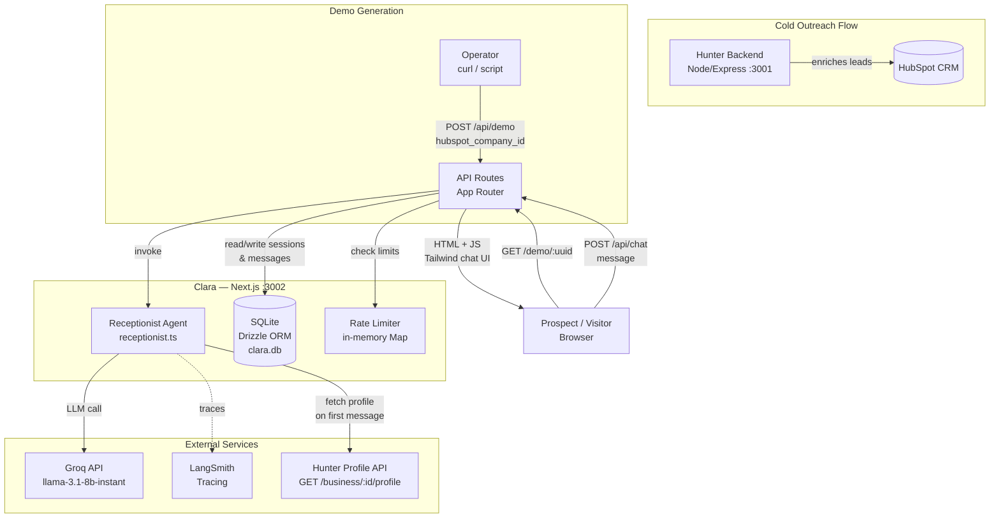

# Architecture Document

**Product:** Clara — AI Chat Receptionist for Local SMBs
**Architect:** Architect Agent
**Date:** 2026-03-24
**Phase:** Explore (v1 Demo Tool)

---

## Adversarial Challenge: Is This the Right Level of Complexity?

Before the design, a direct challenge to the implied architecture.

The current implementation reaches for LangGraph, a stateful graph execution framework designed
for multi-agent workflows with cycles, checkpoints, and conditional branching. The actual agent
work performed by Clara is: build a system prompt from a business profile, prepend message
history, call an LLM, return the response. That is a single-node linear chain — not a graph.

**LangGraph is over-engineered for v1.** The cognitive overhead of a graph state machine is real
and the current code demonstrates this: `receptionist.ts` does not use a StateGraph, StateChannel,
or any LangGraph primitive. It uses LangChain message objects (HumanMessage, AIMessage) with a
direct `llm.invoke()` call. The LangGraph dependency is declared but not exercised.

This is actually the correct outcome — the implementation self-corrected to proportionate
complexity. The ADR below documents this finding and makes a forward-looking decision about
when LangGraph becomes justified. The dependency should either be removed now (saving 40MB of
node_modules) or retained with a documented trigger condition.

The architecture described here reflects the actual system, not the aspirational one.

---

## 1. System Overview

### Component Diagram



### Data Flow: Demo Session Lifecycle

```
1. Operator calls POST /api/demo { hubspot_company_id }
   └─ Clara creates demo_session row (UUID, hubspot_company_id, no profile yet)
   └─ Returns { sessionId, uuid }

2. Operator pastes link into Hunter cold email: /demo/{uuid}

3. Prospect opens link
   └─ GET /demo/:uuid — Next.js page renders chat UI
   └─ GET /api/demo?uuid=X — increments view_count, returns business_name

4. Prospect sends first message
   └─ POST /api/chat { sessionId, message }
   └─ Rate limiter checks IP + session limits
   └─ Agent fetches BusinessProfile from Hunter API (5s timeout, fallback to "This Business")
   └─ Profile cached in demo_sessions.business_name (avoid repeat Hunter calls)
   └─ Agent builds system prompt, prepends message history, calls Groq
   └─ LangSmith trace written (session_id, hubspot_company_id, tokens, latency)
   └─ Response + message pair written to chat_messages
   └─ message_count incremented on demo_sessions
   └─ Reply returned to browser

5. Subsequent messages: profile served from demo_sessions cache, no Hunter API call

6. Lead capture (triggered by agent or visitor action)
   └─ Lead data written to leads table (v1: logged to DB, no notification)
   └─ Agent confirms callback timing to visitor
```

### Service Boundaries

| Boundary | Owned by | Protocol |
|----------|----------|----------|
| Business profile data | Hunter | HTTP GET, 5s timeout, fallback |
| Chat LLM inference | Groq | HTTPS, `@langchain/groq` SDK |
| LLM observability | LangSmith | HTTPS, LangChain callback handler |
| Session + message storage | Clara (SQLite) | In-process (same dyno) |
| Rate limit state | Clara (in-memory Map) | In-process |

---

## 2. Tech Stack Decisions

| Layer | Choice | Rationale | Rejected Alternatives |
|-------|--------|-----------|----------------------|
| Framework | Next.js 14 App Router (TypeScript) | Collocates UI and API in one process; zero-infra local dev; Vercel-native for eventual deployment | Express + React SPA: extra deploy complexity, no benefit at this scale. Remix: smaller ecosystem for this team. |
| LLM provider | Groq (llama-3.1-8b-instant) | Free tier available; sub-2s latency; cost < $0.005/session target met; `GROQ_MODEL` env var allows easy swap | OpenAI GPT-4o: 10x more expensive, no free tier. Anthropic Haiku: good quality but no free tier and latency is comparable to Groq for this task. Ollama (local): works for dev but cannot run on shared hosting; no prod path without GPU. |
| LLM abstraction | `@langchain/groq` + LangChain messages | LangSmith tracing wires in via CallbackHandler with zero instrumentation code; message history handled natively | Raw `fetch()` to Groq: simpler but loses free LangSmith trace integration. OpenAI SDK with Groq compat URL: works but loses type safety for provider-specific params. |
| Agent pattern | Single-node prompt chain (no graph) | Clara's logic is: system prompt + history + message → response. No branching, no cycles, no sub-agents. A graph adds state machine overhead to what is a linear function call. | LangGraph StateGraph: declared in dependencies but not actually used. Justified only when conditional routing (e.g., lead-capture branch vs. FAQ branch) is needed — see ADR-002. |
| Database | SQLite + better-sqlite3 + Drizzle ORM | Synchronous driver means no connection pooling complexity; zero infra for local dev; Drizzle schema is Postgres-compatible (column types + migration files transfer directly); < 50 sessions in v1 generates < 5MB data | PostgreSQL: correct for v2 but adds managed DB cost and connection pooling in v1 where there is literally one operator. MongoDB: no structural advantage; harder migration path. Turso (SQLite edge): premature — adds vendor dependency before the scale problem exists. |
| Rate limiting | In-memory sliding window (Map + timestamp queue) | Zero additional infrastructure; sufficient for v1 single-dyno deployment; no Redis cost; restarts reset state (acceptable — rate limit window is 1 hour) | Redis + `rate-limiter-flexible`: correct for v2 multi-instance; unjustified complexity for single-process v1. Upstash Redis: adds vendor dependency before it is needed. |
| UI | Tailwind CSS + React (Next.js) | Already in project; Tailwind's mobile-first utilities match the primary mobile-browser use case (Maria opens demo on iPhone) | CSS Modules: fine but Tailwind is already set up. Shadcn/UI: adds component library weight for what is essentially a single chat screen. |
| Testing | Vitest | Consistent with monorepo standard; fast; ESM-native; compatible with jsdom for component tests | Jest: slower, requires more babel config for ESM. Playwright: E2E is out of scope for Explore phase. |
| Deployment | Railway (recommended) or Fly.io | Single-dyno Node process; persistent SQLite file via mounted volume; $5–$10/month; no cold starts unlike Vercel serverless (SQLite requires persistent filesystem) | Vercel: serverless functions cannot hold SQLite on disk between invocations. Heroku: legacy pricing. Self-hosted VPS: valid but adds maintenance burden for a tool managing 10–50 sessions. |
| LLM tracing | LangSmith | LangChain integration is one `CallbackHandler` line; project-namespaced (`clara-{NODE_ENV}`); startup enforcement matches pattern used in Hunter | Langfuse: used in Veya, would require cross-project credential sharing. Helicone: adds an HTTP proxy in the hot path; not worth the latency for Groq calls already at sub-2s. |

---

## 3. Architecture Decision Records

### ADR-001: SQLite for v1, Postgres migration required before v2

**Status:** Accepted

**Context:**
Clara v1 targets 10–50 demo sessions operated by a single person. The database access pattern
is almost entirely sequential: one operator creates sessions, one visitor at a time interacts
with each session. There is no concurrent write problem. The existing stack already uses
`better-sqlite3` (synchronous) with Drizzle ORM. A Postgres requirement for v1 would add:
a managed database service cost ($10–25/month minimum), connection pool configuration, and
deployment complexity — all to support a workload that will peak at 2–3 simultaneous users.

**Decision:**
SQLite for v1. Drizzle ORM's schema definitions and migration files use Postgres-compatible
column types. The migration to Postgres is a mechanical adapter swap (change the Drizzle driver
from `better-sqlite3` to `node-postgres`, run `drizzle-kit generate` against the Postgres
dialect, execute the DDL migration). No application logic changes are required.

**Consequences:**
- v1: zero infrastructure cost for the database, zero connection pool configuration.
- Drizzle schema must remain Postgres-compatible: no SQLite-only column types, no
  `AUTOINCREMENT` (use explicit UUID primary keys — already done), no `PRAGMA`-dependent logic.
- The `DATABASE_PATH` env var is SQLite-only. It disappears in v2 and is replaced by
  `DATABASE_URL` (Postgres connection string).
- v2 multi-tenant isolation (one SMB's data is not readable by another) must be enforced at
  the query layer. This is trivially achievable with a `WHERE hubspot_company_id = ?` filter but
  must be explicitly audited before v2 launch.
- SQLite has no built-in connection pool — if v1 is deployed to a multi-process or serverless
  environment, `better-sqlite3` will fail. This constrains the deployment target to
  single-process hosting (Railway, Fly.io single instance) for the duration of v1.

**Revisit trigger:**
Any of the following requires immediate Postgres migration: (a) second SMB onboarded for live
deployment, (b) deployment to multi-process or serverless environment, (c) concurrent write
errors observed in production logs.

---

### ADR-002: Single-node prompt chain over LangGraph for v1 agent

**Status:** Accepted

**Context:**
The project declares `@langchain/langgraph` as a dependency, and the CLAUDE.md describes the
agent as "LangGraph chat agent." The actual `receptionist.ts` implementation uses only LangChain
core message types (`HumanMessage`, `AIMessage`, `SystemMessage`) and a direct `llm.invoke()`
call. No StateGraph, StateChannel, interrupt, or checkpoint primitive is used.

LangGraph is designed for agents that require: conditional routing between nodes, cyclic
execution (retry/loop), multi-step tool use with intermediate state, or checkpointed resumption.
Clara v1 requires none of these. The conversation flow is:
`receive message → build prompt → call LLM → return reply`.

Retaining LangGraph as an unused dependency costs approximately 40MB in `node_modules` and
creates a misleading "complexity signal" for future maintainers.

**Decision:**
Do not use LangGraph for v1. The `receptionist.ts` single-function pattern is the correct
architecture for the current requirements. The `@langchain/langgraph` dependency should be
removed. LangGraph should be reintroduced when one of the following capabilities is required:
(a) conditional routing — e.g., a lead-capture branch that triggers a different node than FAQ
answering; (b) tool-use with multiple steps — e.g., Clara looks up availability in an external
calendar before responding; (c) interrupt/human-in-the-loop — e.g., an uncertain answer is
flagged for operator review before being sent.

**Consequences:**
- Reduced dependency footprint and clearer code for current maintainers.
- LangSmith tracing remains available via LangChain's `CallbackHandler` — this is independent
  of whether LangGraph is used.
- When LangGraph is reintroduced, `runReceptionist()` must be refactored to a `StateGraph`
  with typed state channels. The function signature can remain stable externally.
- The PRD description of "LangGraph chat agent" should be understood as aspirational. Current
  behavior is a linear chain. CLAUDE.md should be updated when this ADR is accepted.

**Revisit trigger:**
Lead capture flow requires conditional branching logic that cannot be expressed cleanly as
if/else inside a single function (estimated: when ≥ 3 conditional branches exist in
`runReceptionist`). Revisit at v2 when multi-step tool use (calendar, CRM write-back) is added.

---

### ADR-003: Shared Knowledgebase — defer, but design the seam now

**Status:** Accepted (decision to defer; interface contract established)

**Context:**
Both Clara (chat) and Veya (voice) respond to visitor questions about the same SMB. Currently:
- Veya holds business context in its own call-session state, populated at call time.
- Clara reads from Hunter's `/business/:id/profile` API at first message, caches in
  `demo_sessions.business_name`.

This creates a data duplication problem: if the SMB owner updates their hours, both Veya and
Clara must be updated separately. The PRD identifies a shared knowledgebase as a "v2
architectural prerequisite before Clara is positioned as a standalone product."

Three architecturally distinct options exist:

**Option A: Hunter's business profile IS the knowledgebase.** Both Veya and Clara query
`GET /business/:id/profile` at inference time. Hunter becomes the system of record. The
profile schema is enriched to include all data both channels need (hours, services, pricing,
escalation contact). Cost: Hunter becomes a dependency in the inference hot path for both
products. Hunter downtime degrades both. Hunter's schema must satisfy both channels' needs.

**Option B: Dedicated knowledgebase microservice.** A new service (`kb-service`) owns SMB
knowledge. Clara, Veya, and Hunter all read/write through it. Pros: clean separation, SMB
owner portal becomes a KB editor. Cons: new service to build, deploy, and maintain — premature
for current scale (< 10 SMBs).

**Option C: Shared Postgres table in Clara v2 DB.** A `smb_knowledge` table lives in Clara's
(v2) Postgres database. Veya queries it via a Clara-owned API. Simple, but creates a coupling
that makes Veya dependent on Clara's availability.

**Decision:**
Defer the knowledgebase implementation to v2, but commit to Option A as the working assumption
for v2 design. Hunter already owns the enrichment pipeline and has the richest data. Extending
Hunter's profile schema is lower cost than building a new service. The Clara ↔ Hunter interface
(the `BusinessProfile` TypeScript type in `receptionist.ts`) is the contract seam — it must be
kept stable and not extended with Clara-specific fields.

**Constraints imposed now (not deferred):**
1. `demo_sessions` must not become a secondary cache of business knowledge. Only `business_name`
   (a display string) is cached. All other profile data is fetched from Hunter at inference time.
   Storing addresses, hours, services in `demo_sessions` would create a stale-data problem.
2. The `BusinessProfile` interface must be treated as a Hunter-owned contract, not a Clara
   internal type. Any extension requires Hunter to add the field to its profile API first.
3. When Veya integration is needed, Hunter's profile API (not Clara's DB) is the join point.

**Consequences:**
- Clara's 5-second Hunter API timeout and fallback behavior must remain robust — it is not
  optional; it is the failure-mode for a production dependency.
- Profile data that changes frequently (hours, special closures) will be stale in Clara for the
  duration of the demo session (profile is cached in `demo_sessions` after first fetch). This is
  acceptable in v1 (demo sessions, not live business data) but must be addressed in v2.
- Before v2: an ADR must be written that either confirms Option A or justifies pivoting to
  Option B, with a concrete schema proposal for the shared knowledge structure.

**Revisit trigger:**
Second SMB onboarded with meaningfully different data requirements than the first; or Veya
integration is scoped into a sprint; or Hunter's profile API cannot be extended to cover a
Clara data requirement without distorting Hunter's own model.

---

### ADR-004: UUID-only session identity — no auth on demo pages

**Status:** Accepted

**Context:**
Demo sessions are designed to be shared publicly — the operator emails a link to a prospect.
There is no login, no account, no identity verification. The UUID provides obscurity (the link
cannot be guessed) but not security (anyone with the link can view the session).

The tradeoff: adding auth (even a simple email gate) would add friction for Maria, the primary
persona. The UX research finding is that Maria opens the link on mobile between clients and will
not fill in an email before she can see the demo. Auth on demo pages would kill the core
conversion mechanic.

**Decision:**
No auth on `/demo/:uuid` or `/api/chat` for v1. UUIDs are generated via `crypto.randomUUID()`
(cryptographically random, 122 bits of entropy — effectively unguessable). The session is
treated as a capability token (possession of the UUID grants access to that session).

**Consequences:**
- Demo sessions must not contain sensitive SMB data beyond what Hunter considers public
  (business name, phone, address, hours, services). Pricing that the SMB considers confidential
  should not be stored in Clara's DB.
- If a demo link is forwarded by the prospect to others, those others gain session access.
  This is acceptable for a demo tool and may even be desirable (word-of-mouth sharing).
- No GDPR-gated PII is collected passively (US-06 acceptance criteria). Session UUID is not
  linkable to a natural person without the operator's CRM records.
- Lead capture data (name, phone/email) collected via the escalation flow IS personal data
  and must be treated as such in v2's GDPR/CCPA compliance implementation.
- In v2 (live widget on SMB websites), this decision must be revisited. A widget deployed
  on a live site needs CORS configuration, origin validation, and potentially SMB-scoped
  API keys to prevent cross-tenant data access.

**Revisit trigger:**
Any live deployment where the chat widget appears on a public SMB website (v2). Also revisit
if a demo link leaks in a way that causes real harm (unlikely but possible).

---

### ADR-005: In-memory rate limiting for v1

**Status:** Accepted

**Context:**
The PRD requires rate limiting on both `/api/chat` (20 msg/session/hour, 10 req/min/IP) and
`/api/demo` (20 session creations/min/IP). The standard solution for production rate limiting
is a Redis-backed store (e.g., `rate-limiter-flexible` with Upstash Redis). This ensures rate
limit state survives process restarts and works across multiple instances.

For v1 on a single-dyno deployment with 10–50 sessions, none of those properties matter:
there is one process, and restarts reset limits gracefully (the window resets, not the content).
The cost of Redis at Upstash free tier is zero, but the architectural complexity is real:
another external service, another env var, another failure surface.

**Decision:**
Implement rate limiting as an in-memory sliding window using a `Map<string, number[]>` (key:
IP or session ID, value: array of request timestamps within the current window). Evict expired
entries on each check. This is < 50 lines of code with zero dependencies.

**Consequences:**
- Rate limit state is lost on process restart. Acceptable: the PRD does not require persistence
  of rate limit state; it requires that abuse is prevented during normal operation.
- Cannot be enforced across multiple instances. Constrains v1 to single-process deployment
  (already required by SQLite — see ADR-001).
- Implementation must be unit-testable by accepting a clock function parameter (avoid
  `Date.now()` hardcoding).
- Migration to Redis-backed rate limiting in v2 requires: add `rate-limiter-flexible` +
  Upstash env vars + replace the in-memory Map with the Redis consumer. The interface
  (a `checkRateLimit(key, limit, windowMs)` function) should be stable.

**Revisit trigger:**
Any multi-instance deployment; or Redis is already present in the stack for another reason;
or rate limit bypass is observed in production logs.

---

### ADR-006: Lead capture data stored in Clara DB — no CRM write-back in v1

**Status:** Accepted

**Context:**
When a visitor triggers the lead capture flow (US-05), they provide name + contact info. The
PRD explicitly excludes "CRM write-back of lead captures" from v1 scope. The operator must
manually review the DB or receive a notification to follow up.

**Decision:**
Add a `leads` table to the SQLite schema (session_id, name, contact, message, created_at).
Lead captures are inserted here. No HubSpot write-back. No notification in v1 (operator
checks DB or runs a query). A simple admin endpoint `GET /api/leads` (operator-only, no auth
in v1 — same UUID obscurity model) surfaces captured leads.

**Consequences:**
- The `leads` table must be included in any DB backup strategy.
- Lead data is PII (name + phone/email). It must be covered by the GDPR compliance work
  before v2. The `hubspot_company_id` linkage enables the SMB owner to request data deletion
  for their leads specifically.
- HubSpot write-back in v2 requires: Hunter's `HUNTER_CONFIRM_CRM_WRITE` HITL gate pattern,
  an ADR on the write-back schema, and Drizzle migration to add a `hubspot_contact_id` column
  on `leads` for deduplication.

**Revisit trigger:**
First SMB goes live and the operator needs real-time notification; or HubSpot write-back is
required to track lead attribution in CRM reporting.

---

## 4. Security Architecture

### Authentication Model

**v1:** No user authentication. Session access is controlled by UUID possession (capability
token model). The operator uses direct API calls and DB access — no authenticated operator
panel exists.

**Threat:** UUID enumeration. A UUID v4 has 122 bits of entropy. Brute force is computationally
infeasible. However, if the `/api/demo` endpoint leaks session IDs in error messages or
logs, enumeration becomes viable. Mitigation: never log full session UUIDs in error responses
returned to the client.

### Authorization Model

| Actor | Can do | Cannot do |
|-------|--------|-----------|
| Anyone with session UUID | Chat with Clara, view business name, trigger lead capture | Access other sessions, enumerate sessions |
| Operator | Create sessions (POST /api/demo), read session metadata (GET /api/demo) | No additional controls in v1 — same as any UUID holder |
| Anonymous (no UUID) | Nothing — all API routes require a valid session UUID | — |

Note: the operator has no elevated privileges in v1. The API design implicitly trusts that
only the operator knows the UUID of a given session (since they create it). This is acceptable
for v1 but must change in v2: operator endpoints need API key auth to prevent third parties
from creating sessions that generate LLM costs.

### Trust Boundaries

```
[Public Internet]
      │
      ▼
[Clara API Routes] — validates UUID presence; rate limits by IP
      │
      ├──── [Hunter API] — trusted internal service, 5s timeout
      │           │
      │      Hunter may return unvalidated SMB data. Clara must not
      │      render raw HTML from Hunter profile fields (XSS risk).
      │      Treat Hunter data as untrusted strings.
      │
      ├──── [Groq API] — trusted LLM provider, HTTPS
      │           │
      │      Groq responses are LLM output — may contain user-influenced
      │      content (prompt injection via visitor messages). Clara must
      │      not execute or eval any Groq output. Display-only.
      │
      └──── [LangSmith] — observability, write-only from Clara's perspective
```

### Data Classification

| Data type | Classification | Storage | Retention |
|-----------|---------------|---------|-----------|
| `hubspot_company_id` | Internal identifier | SQLite | Indefinite (analytics) |
| Business name, hours, services | Public business data | SQLite (cached) | 30-day session window |
| Chat message content | Potentially sensitive | SQLite `chat_messages` | 30-day soft-delete |
| Visitor lead capture (name, contact) | PII — personal data | SQLite `leads` | Until GDPR erasure requested |
| Session UUID | Capability token | SQLite, client URL | Session lifetime |
| Groq API key | Secret | Environment variable only | Rotated quarterly |
| LangSmith API key | Secret | Environment variable only | Rotated quarterly |

### Prompt Injection Defense

Visitor messages are passed directly to the LLM as `HumanMessage` content. A malicious visitor
can attempt to override the system prompt via the message body ("Ignore previous instructions
and..."). Current mitigations:

1. The system prompt is injected as a `SystemMessage` — the only position that is resistant to
   role-injection in Groq's model.
2. `maxTokens: 512` caps response length — prevents exfiltration of large data via a verbose
   jailbreak response.
3. The business profile data injected into the system prompt must be HTML-escaped before
   rendering (prevents stored XSS if a Hunter profile field contains `<script>` tags).

No additional LLM firewall is warranted at v1 scale. Groq's Llama-3.1-8b-instant has built-in
instruction following that resists basic prompt injection. Monitor LangSmith traces for
anomalous system prompt overrides.

### Rate Limiting as Abuse Defense

Primary cost risk: a malicious actor sends 10,000 messages to a demo session, generating
significant Groq API spend. Rate limits defined in the PRD and enforced by ADR-005:

- Per-session: 200 messages hard cap (hard stop, not a sliding window)
- Per-session: 20 messages per hour sliding window
- Per-IP: 10 chat requests per minute
- Per-IP: 20 demo creation requests per minute

The 200-message hard cap is the most important cost control. LangSmith token tracking provides
the second line of defense (visibility into unusual cost spikes).

### Compliance Status (v1)

| Requirement | Status | Notes |
|-------------|--------|-------|
| GDPR right-to-erasure | Not implemented | Leads table contains PII. Must be implemented before v2 live deployment. |
| CCPA disclosure | Not implemented | No California-specific consent UI. Must be scoped before v2. |
| Cookie consent | Not applicable | Clara sets no cookies. Session is URL-based (UUID). |
| Data processing agreement | Not required for v1 | Required before live SMB deployment in v2. |

---

## 5. Infrastructure Plan

### Environments

| Environment | Host | Database | Purpose |
|-------------|------|----------|---------|
| Local dev | `localhost:3002` | `./clara.db` (gitignored) | Development |
| Staging | Railway (single dyno) | SQLite on persistent volume | Pre-production testing with real Hunter API |
| Production | Railway (single dyno) | SQLite on persistent volume | Live v1 demo sessions |

Note: there is currently no staging environment. Before the first real prospect demo is sent,
a staging environment must exist. The cost is $5/month on Railway. This is non-negotiable: the
operator should be able to test a new demo session against the production Hunter API without
risking the live environment.

### Deployment Architecture (Railway)

```
Railway Project: clara
├── Service: clara-app
│   ├── Source: GitHub main branch (auto-deploy on push)
│   ├── Build: npm run build
│   ├── Start: npm run start
│   └── Volume: /data (persistent SQLite mount)
├── Environment: staging
│   └── DATABASE_PATH=/data/clara-staging.db
└── Environment: production
    └── DATABASE_PATH=/data/clara-production.db
```

### CI/CD Approach

Simple GitHub Actions workflow (not yet present — must be added):

```
on: push to main
jobs:
  test: npm run test && npm run typecheck
  deploy-staging: railway deploy --service clara-app --environment staging
  # Production deploy: manual trigger only (operator approves)
```

No automated production deploy — operator reviews staging before promoting. At v1 scale
(solo operator, < 50 sessions), this is the right tradeoff.

### Environment Variables

| Variable | Required in Production | Purpose |
|----------|----------------------|---------|
| `GROQ_API_KEY` | Yes | Groq LLM inference |
| `LANGSMITH_API_KEY` | Yes (production), No (dev/test) | LLM observability |
| `LANGSMITH_TRACING` | Yes = `"true"` (production) | Enables LangSmith trace emission |
| `HUNTER_API_URL` | Yes | Hunter profile API base URL |
| `HUNTER_API_KEY` | If Hunter auth is enabled | Bearer token for Hunter API |
| `DATABASE_PATH` | No (defaults to `./clara.db`) | SQLite file path |
| `GROQ_MODEL` | No (defaults to `llama-3.1-8b-instant`) | LLM model override |
| `PORT` | No (defaults to 3002) | HTTP port |
| `NODE_ENV` | Yes | `production` in prod; gates startup enforcement |

Variables that must NOT appear in `.env.example` with real values: all API keys.
Variables that MUST appear in `.env.example` with placeholder values: all of the above.

### Startup Enforcement (Production Gate)

Matching the pattern from Hunter and Veya, `src/app/api/startup.ts` (or equivalent top-level
init) must enforce in production:

```typescript
if (process.env.NODE_ENV === 'production') {
  if (!process.env.LANGSMITH_API_KEY || process.env.LANGSMITH_TRACING !== 'true') {
    console.error('[Clara] LANGSMITH_API_KEY and LANGSMITH_TRACING=true are required in production')
    process.exit(1)
  }
}
```

### Session Cleanup (Cron)

Sessions older than 30 days are eligible for soft-delete (PRD requirement). In v1 with SQLite
on Railway, a cron job is implemented as a Next.js API route called by Railway's cron
scheduler or a simple GitHub Actions scheduled workflow:

```
GET /api/admin/cleanup
  → UPDATE demo_sessions SET deleted_at = NOW() WHERE created_at < NOW() - 30 days
  → Returns { archivedCount }
```

The `deleted_at` column must be added to the schema. Queries must filter `WHERE deleted_at IS NULL`
for active sessions. Hard delete is deferred — retain rows for analytics.

### Backup and Recovery

SQLite file on Railway persistent volume. Railway persistent volumes are not themselves backed
up by default. Recovery strategy:

- Daily: `sqlite3 /data/clara.db .dump > backup-$(date +%Y%m%d).sql` piped to an S3 bucket
  (or GitHub Gist for v1 simplicity)
- Recovery: restore dump to new volume, restart service
- Target RTO: < 2 hours (acceptable for a demo tool, not a live customer-facing product)
- This strategy must be upgraded before v2 live deployment

### Monitoring and Alerting

| Concern | Tool | Alert condition |
|---------|------|----------------|
| LLM costs | LangSmith | Manual review of token counts; no automated alert in v1 |
| Error rate | Railway logs + Vercel/Sentry (optional) | 5xx spike visible in Railway dashboard |
| Session error rate | LangSmith trace failures | Manual review |
| DB size | Railway volume metrics | > 500MB triggers SQLite review |

Sentry is not required for v1 Explore phase. Add before v2 Extract-phase promotion.

---

## 6. V1 to V2 Migration Path

### What Changes and When

The v1 → v2 transition is triggered when one or more SMBs are onboarded for live widget
deployment. At that point, four architectural changes become mandatory (not optional).

### Change 1: SQLite → PostgreSQL (Mandatory before v2)

The in-process SQLite driver cannot handle concurrent writes from multiple visitor sessions
on multiple SMB websites simultaneously.

Migration steps:
1. Add `DATABASE_URL` env var (Postgres connection string)
2. Switch Drizzle adapter: `import { drizzle } from 'drizzle-orm/node-postgres'`
3. Run `drizzle-kit generate --dialect=postgresql` to regenerate migration files
4. Execute DDL on new Postgres instance
5. Migrate data: `pg_restore` from SQLite dump (one-time data migration script)
6. Remove `DATABASE_PATH` env var and `better-sqlite3` dependency
7. Add `postgres` or `pg` package, configure connection pool (max 10 connections for v2 start)

Drizzle schema compatibility notes:
- All primary keys use `text('id')` (UUID strings) — compatible with Postgres `text` or `uuid`
- `text('created_at')` ISO string timestamps should be migrated to `timestamp` type for
  Postgres indexing efficiency
- No `INTEGER` primary keys — no `AUTOINCREMENT` to remove
- Estimated effort: 1–2 days

### Change 2: Redis-backed rate limiting (Mandatory before v2)

Multiple processes or a CDN in front of Clara means in-memory rate limiting is ineffective.
The `checkRateLimit()` function interface (see ADR-005) is stable — swap the implementation.

Migration steps:
1. Add Upstash Redis (or Railway Redis addon)
2. Replace in-memory Map with `rate-limiter-flexible` + Redis store
3. Add `REDIS_URL` env var
4. Estimated effort: 4–8 hours

### Change 3: Widget isolation and CORS (Required for embeddable widget)

The embeddable `<script>` widget embeds Clara in a third-party website. This requires:

1. CORS: `/api/chat` and `/api/demo` must accept requests from the SMB's domain. Add
   `ALLOWED_ORIGINS` env var (comma-separated list or `*` for public, but `*` is not
   acceptable when session UUIDs are in use).
2. Session scoping: the widget must be initialized with a `hubspot_company_id` (or an opaque
   `widget_key` that maps to one), not a session UUID. On first load, the widget creates a
   new session and stores the resulting UUID in `sessionStorage` (not `localStorage` — tab-scoped).
3. Origin validation: `POST /api/demo` must validate that the requesting origin is a registered
   domain for the given `hubspot_company_id`. This requires a `registered_domains` table.
4. Shadow DOM: the widget script injects into a shadow root to avoid CSS bleed from the host
   page. Next.js is not the right host for the widget JS — the widget script should be a
   plain TypeScript file compiled to a standalone bundle (Vite + `iife` format).

Architecture implication: Clara becomes two deployable artifacts in v2:
- `clara-app`: Next.js (chat UI + API routes) — unchanged
- `clara-widget.js`: standalone bundle served from CDN (Cloudflare R2 or similar)

### Change 4: Multi-tenant data isolation (Required before v2)

All queries must include `hubspot_company_id` in the WHERE clause. SQLite's single-file model
does not have a tenant isolation problem (one file per deployment), but Postgres requires
explicit scoping.

Audit checklist before v2 launch:
- [ ] Every `demo_sessions` query includes `WHERE hubspot_company_id = ?` unless admin
- [ ] `chat_messages` accessed only via `session_id` (which is scoped to a `hubspot_company_id`)
- [ ] `leads` table has `hubspot_company_id` column for direct lookup
- [ ] No query returns rows across multiple `hubspot_company_id` values without operator auth

### What Does NOT Change

- The `receptionist.ts` agent logic (system prompt construction, Groq call, history management)
- The `BusinessProfile` interface contract with Hunter
- LangSmith tracing integration
- Drizzle ORM schema structure (column names, types — modulo timestamp upgrade)
- The UUID-based session model for demo pages

### V2 Feature Sequence (Recommended Build Order)

1. Postgres migration + connection pool
2. Redis rate limiting
3. `leads` table GDPR erasure endpoint + HubSpot write-back (with HITL gate)
4. SMB self-serve portal: knowledge base editor + lead view
5. Shared knowledgebase with Veya (triggers ADR update — see ADR-003)
6. Embeddable widget (shadow DOM + CDN bundle)
7. Real-time notifications (email/SMS on lead capture)
8. Pricing + subscription management

---

## Open Questions (Require Founder Decision Before v2)

1. **Widget hosting model:** will Clara be a standalone SaaS (SMBs sign up directly) or remain
   an operator-deployed tool (founder onboards each SMB)? The answer determines whether a
   self-serve portal is v2 or v3, and whether multi-tenant auth is needed in v2 at all.

2. **Groq reliability SLA:** Groq is a newer provider with occasional downtime. For v1 demos
   this is acceptable. For v2 live widgets where an SMB's customers are waiting for a response,
   a fallback LLM (Claude Haiku or GPT-4o-mini) should be specified. Budget impact: ~2x cost
   per token for the fallback tier. This decision must be made before v2 go-live.

3. **Data residency:** if any SMB client is in the EU, GDPR requires that visitor conversation
   data (personal data) be stored in EU infrastructure. Railway and Fly.io both offer EU regions.
   This is a deployment configuration question, not a code question — but it must be answered
   before any EU SMB is onboarded.

---

*Clara Architecture v1.0 — 2026-03-24*
*Author: Architect Agent*
*Next review: Phase 1 retrospective (Week 6) or before any v2 build starts*
