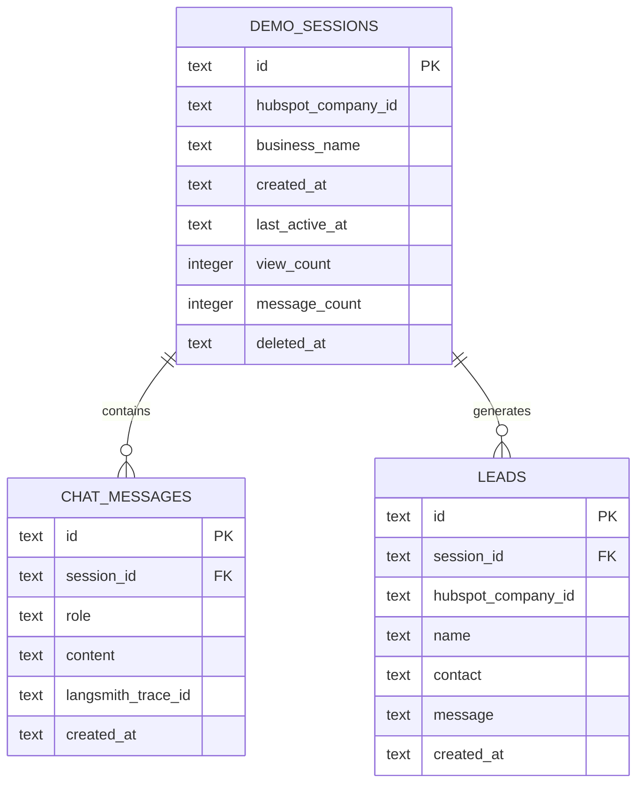

# Data Model

**Product:** Clara — AI Chat Receptionist for Local SMBs
**DB Architect:** DB Architect Agent
**Database Engine:** SQLite (better-sqlite3) + Drizzle ORM — Postgres-compatible schema (v2 driver swap only)
**Date:** 2026-03-24
**Phase:** Explore (v1)

---

## Part 1 — What I Received

**Database engine:** SQLite via `better-sqlite3`, managed by Drizzle ORM. Migrations are currently
inline DDL executed at startup (`db/index.ts`) and via a standalone `migrate.ts` script.
There is no file-based migration history yet.

**Existing entities (ground truth from `schema.ts` and inline DDL):**
- `demo_sessions` — one row per demo link issued; holds the hubspot_company_id, cached business_name, and engagement counters
- `chat_messages` — one row per message turn (user or assistant); foreign-keyed to demo_sessions

**New entities required by the architecture doc:**
- `leads` — PII table for visitor name + contact info captured during demo
- `rate_limit_events` — optional persistence layer for the in-memory rate limiter (see note in indexing section)

---

## Part 2 — Assumptions Made

1. **UUIDs as primary keys (text, not integer)** — already in use. Preserved. This is correct:
   UUIDs are safe for public URLs, avoid sequential enumeration, and are Postgres-compatible
   without the SQLite AUTOINCREMENT hazard.

2. **Timestamps stored as ISO-8601 text strings** — already in use (`TEXT NOT NULL DEFAULT (datetime('now'))`).
   This is Postgres-incompatible at the type level but is a mechanical fix: in v2 the Drizzle
   dialect switch changes these to `TIMESTAMP WITH TIME ZONE`. All application-layer comparisons
   use ISO string sorting, which is correct for UTC timestamps.

3. **Soft deletes on `demo_sessions` only** — `deleted_at` is added to `demo_sessions` (architecture
   doc, session cleanup section). `chat_messages` and `leads` are never soft-deleted independently;
   they are accessible only via their session or business scope. Hard deletion of leads
   (GDPR erasure) deletes the row directly.

4. **Single-tenant in v1** — one SQLite file serves all sessions. No row-level security required.
   The `hubspot_company_id` column on every relevant table is the logical tenant key for v2
   multi-tenant audit readiness.

5. **`langsmith_trace_id` stored on `chat_messages`** — each assistant turn has a 1:1 relationship
   with a LangSmith trace. Storing it on the message row (not the session) is the correct
   granularity: one session has many traces, one per inference call.

6. **`leads` is a soft junction between a session and a natural person** — a visitor can capture
   their lead exactly once per session (the architecture implies one lead capture per demo
   interaction). If this needs to change (multiple contacts per session), a `UNIQUE(session_id)`
   constraint is removed. For v1, the constraint is applied.

7. **`rate_limit_events` is NOT added to the schema** — the architecture explicitly specifies
   in-memory rate limiting (ADR-005). Persisting rate limit events to SQLite would (a) create a
   write-heavy table with no read value, (b) contradict the ADR decision, and (c) be invalidated
   on restart anyway. Rate limiting stays in-memory. The DB schema does not model it.

8. **No `smb_profile` or knowledge cache table** — ADR-003 explicitly prohibits caching business
   profile data beyond `business_name`. Hours, services, address, and pricing are fetched from
   Hunter at inference time. Storing them would create a stale-data problem.

---

## Part 3 — Adversarial Challenge: The `leads` Cardinality Assumption

The architecture describes lead capture as a single flow: visitor provides name + contact,
row is written to `leads`. This sounds like a one-to-one relationship (one session, one lead).

**The actual cardinality is one-to-many, and the model must reflect that.**

Here is the scenario: a prospect opens the demo, chats for five minutes, does not convert. The
operator re-sends the link three weeks later. The same UUID session is opened again. The visitor
provides their details a second time (or a different person on the same team uses the same link).
If `leads` has a `UNIQUE(session_id)` constraint, the second capture silently fails or errors.

The correct model: `leads` is a one-to-many child of `demo_sessions`. Each row is a discrete
lead capture event with its own timestamp. The operator can see multiple captures per session
and choose the most recent. This is also the correct model for the "multiple contacts per
session" case (Maria and her business partner both fill in their details after seeing the demo).

**Decision made here:** `UNIQUE(session_id)` is NOT applied. `leads` is many-to-one against
`demo_sessions`. A `created_at` DESC index gives the operator the most recent capture per session
when needed.

---

## Part 4 — Decisions Made (No Founder Input Required for v1 Scope)

| Decision | Choice | Rationale |
|----------|--------|-----------|
| Primary key type | UUID text | Already in use; correct |
| Timestamp storage | ISO-8601 text | Already in use; mechanical fix in v2 |
| Soft deletes | `deleted_at` on `demo_sessions` only | Architecture doc requirement; leads get hard delete for GDPR |
| `leads` cardinality | Many-to-one (no unique session constraint) | See adversarial challenge above |
| `langsmith_trace_id` granularity | On `chat_messages` (per inference call) | 1:1 with Groq call |
| Multi-tenancy | Not enforced in v1; `hubspot_company_id` present for v2 readiness | Single SQLite file in v1 |
| `rate_limit_events` table | Not added | Contradicts ADR-005; in-memory only |

---

## 1. Entity Definitions

### `demo_sessions`

Represents a single demo link issued to a prospect on behalf of an SMB. One row is created
by the operator when they generate a demo URL. The session is the top-level container for
all chat activity and lead data associated with that prospect interaction. A session is bound
to exactly one SMB (via `hubspot_company_id`) and is accessed exclusively via its UUID.

| Column | Type | Constraints | Purpose |
|--------|------|-------------|---------|
| `id` | TEXT | PRIMARY KEY | Cryptographically random UUID (122-bit entropy). Used in demo URLs as the capability token. |
| `hubspot_company_id` | TEXT | NOT NULL | Universal identifier linking this session to the SMB in Hunter's CRM. Logical tenant key for v2 multi-tenant isolation. |
| `business_name` | TEXT | nullable | Cached display name from Hunter's profile API, populated on first chat message. Only field cached from Hunter to avoid stale-data risk on hours/services. NULL until first message is sent. |
| `created_at` | TEXT | NOT NULL, DEFAULT now | ISO-8601 UTC timestamp of session creation. |
| `last_active_at` | TEXT | NOT NULL, DEFAULT now | Updated on every chat message. Used to sort active sessions and drive session expiry logic. |
| `view_count` | INTEGER | NOT NULL, DEFAULT 0 | Incremented each time GET /api/demo is called. Engagement signal for operator. |
| `message_count` | INTEGER | NOT NULL, DEFAULT 0 | Incremented on each user message. Used to enforce the 200-message hard cap rate limit. |
| `deleted_at` | TEXT | nullable | ISO-8601 UTC timestamp. NULL = active session. Set by the cleanup cron for sessions older than 30 days. All active-session queries filter WHERE deleted_at IS NULL. |

### `chat_messages`

Represents a single message turn in a demo conversation — either a visitor's message or
Clara's reply. Messages are immutable once written; they form the conversation history
reconstructed on each inference call. Each assistant-role message carries the LangSmith trace
ID linking it to the specific Groq inference call that produced it.

| Column | Type | Constraints | Purpose |
|--------|------|-------------|---------|
| `id` | TEXT | PRIMARY KEY | UUID per message. |
| `session_id` | TEXT | NOT NULL, FK → demo_sessions.id | Which session this message belongs to. |
| `role` | TEXT | NOT NULL, CHECK IN ('user','assistant') | Distinguishes visitor input from Clara's reply. Determines how the message is reconstructed into HumanMessage / AIMessage for the next inference call. |
| `content` | TEXT | NOT NULL | The full text of the message. Stored as-is. Never truncated (the 512 maxTokens cap on Groq responses bounds assistant content at write time). |
| `langsmith_trace_id` | TEXT | nullable | The LangSmith run ID returned by the CallbackHandler, written for every assistant-role message. NULL for user-role messages. Enables trace → message correlation in LangSmith UI. |
| `created_at` | TEXT | NOT NULL, DEFAULT now | ISO-8601 UTC. Used to order history for the next inference call. |

### `leads`

Represents a voluntary lead capture event where a visitor provided their contact information
during a demo interaction. Each row is a discrete capture event — one session can have
multiple lead rows (visitor submits more than once, or multiple people use the same link).
Lead data is PII under GDPR and CCPA and must be hard-deleted on erasure request, not soft-deleted.

| Column | Type | Constraints | Purpose |
|--------|------|-------------|---------|
| `id` | TEXT | PRIMARY KEY | UUID per lead capture event. |
| `session_id` | TEXT | NOT NULL, FK → demo_sessions.id | Which demo session triggered the capture. |
| `hubspot_company_id` | TEXT | NOT NULL | Denormalized from the session for direct tenant-scoped queries without joining to demo_sessions. Required for v2 multi-tenant isolation and GDPR erasure scoped to an SMB. |
| `name` | TEXT | NOT NULL | Visitor's self-reported name. Free-text, no normalization in v1. |
| `contact` | TEXT | NOT NULL | Visitor's self-reported email address or phone number. Single field (visitor provides whichever they prefer). Not validated in v1. |
| `message` | TEXT | nullable | Optional note the visitor left alongside their contact info. May be NULL if the lead capture flow did not prompt for a message. |
| `created_at` | TEXT | NOT NULL, DEFAULT now | ISO-8601 UTC timestamp of the capture event. When multiple captures exist per session, ORDER BY created_at DESC gives the most recent. |

---

## 2. Schema Definition (Drizzle ORM — SQLite dialect)

```typescript
import { sqliteTable, text, integer } from 'drizzle-orm/sqlite-core'

// ─── demo_sessions ──────────────────────────────────────────────────────────

export const demoSessions = sqliteTable('demo_sessions', {
  id:                text('id').primaryKey(),
  hubspotCompanyId:  text('hubspot_company_id').notNull(),
  businessName:      text('business_name'),
  createdAt:         text('created_at').notNull().$defaultFn(() => new Date().toISOString()),
  lastActiveAt:      text('last_active_at').notNull().$defaultFn(() => new Date().toISOString()),
  viewCount:         integer('view_count').notNull().default(0),
  messageCount:      integer('message_count').notNull().default(0),
  deletedAt:         text('deleted_at'),
})

// ─── chat_messages ───────────────────────────────────────────────────────────

export const chatMessages = sqliteTable('chat_messages', {
  id:               text('id').primaryKey(),
  sessionId:        text('session_id').notNull().references(() => demoSessions.id),
  role:             text('role', { enum: ['user', 'assistant'] }).notNull(),
  content:          text('content').notNull(),
  langsmithTraceId: text('langsmith_trace_id'),
  createdAt:        text('created_at').notNull().$defaultFn(() => new Date().toISOString()),
})

// ─── leads ───────────────────────────────────────────────────────────────────

export const leads = sqliteTable('leads', {
  id:               text('id').primaryKey(),
  sessionId:        text('session_id').notNull().references(() => demoSessions.id),
  hubspotCompanyId: text('hubspot_company_id').notNull(),
  name:             text('name').notNull(),
  contact:          text('contact').notNull(),
  message:          text('message'),
  createdAt:        text('created_at').notNull().$defaultFn(() => new Date().toISOString()),
})

// ─── TypeScript types ─────────────────────────────────────────────────────────

export type DemoSession    = typeof demoSessions.$inferSelect
export type NewDemoSession = typeof demoSessions.$inferInsert
export type ChatMessage    = typeof chatMessages.$inferSelect
export type NewChatMessage = typeof chatMessages.$inferInsert
export type Lead           = typeof leads.$inferSelect
export type NewLead        = typeof leads.$inferInsert
```

---

## 3. Entity Relationship Diagram



**Relationship notes:**

- `DEMO_SESSIONS` to `CHAT_MESSAGES` — one-to-many. A session has zero messages at creation;
  messages accumulate as the conversation progresses. Messages are never re-parented.
- `DEMO_SESSIONS` to `LEADS` — one-to-many. A session has zero or more lead capture events.
  The most common case is zero or one; the schema permits many (see adversarial challenge above).
- There is no direct relationship between `CHAT_MESSAGES` and `LEADS`. A lead capture event
  is an action the visitor takes alongside the conversation, not a response to a specific message.

---

## 4. Indexing Strategy

The query patterns driving Clara's access are well-defined and narrow. All indexes below are
justified by a specific query that would otherwise be a full table scan.

| Table | Index Columns | Type | Query Supported | Notes |
|-------|--------------|------|-----------------|-------|
| `demo_sessions` | `(hubspot_company_id)` | B-tree | "All sessions for this SMB" — used by v2 multi-tenant isolation and `GET /api/leads?company=X` | Low cardinality in v1 (10–50 sessions per company), but required before v2 goes multi-tenant |
| `demo_sessions` | `(deleted_at)` | B-tree (partial: WHERE deleted_at IS NULL) | "All active sessions" — used by the cleanup cron and any admin listing | In SQLite, a partial index requires `CREATE INDEX ... WHERE deleted_at IS NULL`; in Postgres this is native partial index syntax |
| `demo_sessions` | `(created_at DESC)` | B-tree | "Sessions ordered by newest" — used by `GET /api/leads` operator listing | Composite with `hubspot_company_id` in v2: `(hubspot_company_id, created_at DESC)` |
| `chat_messages` | `(session_id, created_at ASC)` | B-tree (composite) | "Full conversation history for a session, in order" — the primary read path for every inference call | The ASC ordering matters: history is reconstructed oldest-first for the LLM context window |
| `leads` | `(session_id)` | B-tree | "All lead captures for a session" — used by `GET /api/leads?session=X` | |
| `leads` | `(hubspot_company_id, created_at DESC)` | B-tree (composite) | "Most recent lead captures across all sessions for an SMB" — the primary operator view | The `hubspot_company_id` prefix makes this tenant-scoped in v2 |

**Indexes NOT added (and why):**

- `chat_messages(langsmith_trace_id)` — traces are looked up in LangSmith's own UI, not by
  querying Clara's DB. No application query path goes from trace ID to message.
- `demo_sessions(message_count)` — message count is read from the session row directly on every
  chat request (the row is already fetched by ID). No range query on message_count.
- `leads(contact)` — no deduplication query is required in v1. If dedup becomes needed in v2
  (avoid inserting the same email twice), add a partial unique index then.

---

## 5. Migration Plan

### Current State

The existing schema is defined via inline DDL strings in two places:
- `src/db/index.ts` (executed at every app startup via `sqlite.exec(...)`)
- `src/db/migrate.ts` (standalone migration runner)

Both create the same two tables. There is no migration history, no version tracking, and no
rollback capability. Adding columns to this pattern requires editing both files and manually
running `ALTER TABLE` against live databases.

### Migration Strategy for v1

**Tool:** Drizzle Kit (`drizzle-kit generate` + `drizzle-kit migrate`)
**Format:** SQL migration files in `src/db/migrations/`
**Naming convention:** `NNNN_description.sql` (zero-padded sequence, e.g. `0001_initial_schema.sql`)
**Direction:** Up migrations only for v1 (Explore phase). Down migrations required before
Extract-phase promotion.

The inline DDL in `db/index.ts` and `db/migrate.ts` should be replaced with Drizzle Kit's
generated migration runner (`drizzle-kit migrate`) as part of the same change that adds the
new columns. This is not a destructive change — `CREATE TABLE IF NOT EXISTS` semantics
mean the existing tables are unaffected.

### Migration 0001 — Initial Schema (retroactive baseline)

Captures the existing two tables as the baseline so future diffs are clean.

```sql
-- 0001_initial_schema.sql
-- Retroactive baseline: captures the tables created by the inline DDL.
-- No-op against any database that already has these tables (IF NOT EXISTS).

CREATE TABLE IF NOT EXISTS demo_sessions (
  id                  TEXT PRIMARY KEY,
  hubspot_company_id  TEXT NOT NULL,
  business_name       TEXT,
  created_at          TEXT NOT NULL DEFAULT (datetime('now')),
  last_active_at      TEXT NOT NULL DEFAULT (datetime('now')),
  view_count          INTEGER NOT NULL DEFAULT 0,
  message_count       INTEGER NOT NULL DEFAULT 0
);

CREATE TABLE IF NOT EXISTS chat_messages (
  id          TEXT PRIMARY KEY,
  session_id  TEXT NOT NULL REFERENCES demo_sessions(id),
  role        TEXT NOT NULL CHECK (role IN ('user', 'assistant')),
  content     TEXT NOT NULL,
  created_at  TEXT NOT NULL DEFAULT (datetime('now'))
);
```

### Migration 0002 — Add `deleted_at` to `demo_sessions`

Required for session expiry (architecture doc, session cleanup section).

```sql
-- 0002_add_session_soft_delete.sql
-- Adds soft-delete support to demo_sessions.
-- NULL = active. Set by cleanup cron for sessions older than 30 days.
-- All active-session queries must add: WHERE deleted_at IS NULL

ALTER TABLE demo_sessions ADD COLUMN deleted_at TEXT;

CREATE INDEX IF NOT EXISTS idx_demo_sessions_deleted_at
  ON demo_sessions(deleted_at)
  WHERE deleted_at IS NULL;
```

**Blast radius:** Additive only. Existing rows get `deleted_at = NULL` (active). No data loss.
All existing queries that do not filter `deleted_at` continue to return all rows — operators
must add `WHERE deleted_at IS NULL` to any listing queries. The cleanup cron is what writes
to this column.

### Migration 0003 — Add `langsmith_trace_id` to `chat_messages`

Required for LangSmith trace → message correlation.

```sql
-- 0003_add_langsmith_trace_id.sql
-- Stores the LangSmith run ID on each assistant-role chat message.
-- NULL for user-role messages and for any messages written before this migration.

ALTER TABLE chat_messages ADD COLUMN langsmith_trace_id TEXT;
```

**Blast radius:** Additive only. Existing assistant messages get `langsmith_trace_id = NULL`.
No index needed (not queried by trace ID from the app layer).

### Migration 0004 — Add `leads` table

Required for lead capture (ADR-006).

```sql
-- 0004_add_leads_table.sql
-- Lead capture events. Each row is a visitor who provided contact info during a demo.
-- One session can generate multiple lead rows (see data-model adversarial challenge).
-- PII table: hard-delete on GDPR erasure, no soft delete.

CREATE TABLE IF NOT EXISTS leads (
  id                  TEXT PRIMARY KEY,
  session_id          TEXT NOT NULL REFERENCES demo_sessions(id),
  hubspot_company_id  TEXT NOT NULL,
  name                TEXT NOT NULL,
  contact             TEXT NOT NULL,
  message             TEXT,
  created_at          TEXT NOT NULL DEFAULT (datetime('now'))
);

CREATE INDEX IF NOT EXISTS idx_leads_session_id
  ON leads(session_id);

CREATE INDEX IF NOT EXISTS idx_leads_company_created
  ON leads(hubspot_company_id, created_at DESC);
```

**Blast radius:** New table only. No existing table is modified.

### Migration 0005 — Add remaining indexes on existing tables

Adds the query-supporting indexes on `demo_sessions` and `chat_messages` identified in
section 4.

```sql
-- 0005_add_query_indexes.sql
-- Indexes supporting the known query patterns for Clara v1.

CREATE INDEX IF NOT EXISTS idx_demo_sessions_company
  ON demo_sessions(hubspot_company_id);

CREATE INDEX IF NOT EXISTS idx_demo_sessions_created_at
  ON demo_sessions(created_at DESC);

CREATE INDEX IF NOT EXISTS idx_chat_messages_session_created
  ON chat_messages(session_id, created_at ASC);
```

**Blast radius:** Index creation only. No data change. May briefly lock the table on creation
but SQLite's `CREATE INDEX IF NOT EXISTS` is safe to re-run.

### Migration Safety Rules

1. **Additive only in v1** — no `DROP TABLE`, no `DROP COLUMN`, no column type changes.
2. **`IF NOT EXISTS` on all DDL** — migrations are idempotent; safe to re-run.
3. **`ALTER TABLE ... ADD COLUMN` does not backfill** — new columns on existing rows are NULL.
   Application code must treat these columns as nullable until the session row is updated.
4. **Index creation is non-blocking in SQLite** — no `CONCURRENTLY` needed (that is a
   Postgres-specific concern for v2).
5. **Test against fresh DB in CI** — the migration runner in `src/db/migrate.ts` should be
   replaced with `drizzle-kit migrate` and executed in the GitHub Actions test job.

---

## 6. Data Flow

### Flow 1: Create Demo Session

**Trigger:** `POST /api/demo { hubspot_company_id }`

```
1. API route receives hubspot_company_id
2. Validate: hubspot_company_id is a non-empty string
3. Generate UUID via crypto.randomUUID()
4. INSERT INTO demo_sessions
     (id, hubspot_company_id, created_at, last_active_at, view_count, message_count)
   VALUES
     (uuid, hubspot_company_id, now(), now(), 0, 0)
   -- business_name is NULL (not yet fetched from Hunter)
   -- deleted_at is NULL (active)
5. Return { sessionId: uuid, uuid }
```

**Tables written:** `demo_sessions` (1 INSERT)
**Tables read:** none
**Indexes used:** none (INSERT by PK)

---

### Flow 2: Send Chat Message

**Trigger:** `POST /api/chat { sessionId, message }`

```
1. Fetch session: SELECT * FROM demo_sessions WHERE id = sessionId AND deleted_at IS NULL
   → 404 if not found or soft-deleted
2. Check rate limits (in-memory):
   - session message_count >= 200 → 429 Hard cap
   - session messages in last hour >= 20 → 429 Hourly window
   - IP requests in last minute >= 10 → 429 IP window
3. If business_name IS NULL on session:
   a. Fetch BusinessProfile from Hunter API (5s timeout)
   b. On success: UPDATE demo_sessions SET business_name = profile.name WHERE id = sessionId
   c. On failure: use "This Business" in-memory (do NOT write to DB — avoids caching the fallback)
4. Fetch message history:
   SELECT id, role, content FROM chat_messages
   WHERE session_id = sessionId
   ORDER BY created_at ASC
   → Uses idx_chat_messages_session_created
5. Build system prompt from business_name + message history
6. Call Groq via LangChain (LangSmith CallbackHandler attached)
7. Capture langsmith_trace_id from callback run ID
8. INSERT INTO chat_messages (id, session_id, role, content, langsmith_trace_id, created_at)
   VALUES (uuid, sessionId, 'user', message, NULL, now())
9. INSERT INTO chat_messages (id, session_id, role, content, langsmith_trace_id, created_at)
   VALUES (uuid, sessionId, 'assistant', reply, traceId, now())
10. UPDATE demo_sessions
    SET message_count = message_count + 1,
        last_active_at = now()
    WHERE id = sessionId
11. Return { reply, messageId }
```

**Tables read:** `demo_sessions` (by PK), `chat_messages` (by session_id + created_at index)
**Tables written:** `chat_messages` (2 INSERTs), `demo_sessions` (1 UPDATE)
**Indexes used:** `idx_chat_messages_session_created` (step 4)
**External calls:** Hunter API (conditional, step 3a), Groq API (step 6), LangSmith trace (step 6)

---

### Flow 3: Capture Lead

**Trigger:** Visitor submits contact info via chat UI (agent-triggered or form action)
**Endpoint:** `POST /api/leads { sessionId, name, contact, message? }`

```
1. Fetch session: SELECT hubspot_company_id FROM demo_sessions
   WHERE id = sessionId AND deleted_at IS NULL
   → 404 if session invalid or expired
2. Validate: name is non-empty, contact is non-empty
3. INSERT INTO leads
     (id, session_id, hubspot_company_id, name, contact, message, created_at)
   VALUES
     (uuid, sessionId, session.hubspot_company_id, name, contact, message, now())
4. Return { leadId: uuid }
```

**Tables read:** `demo_sessions` (by PK, to get hubspot_company_id)
**Tables written:** `leads` (1 INSERT)
**Indexes used:** none on write; `idx_leads_session_id` and `idx_leads_company_created` serve
future reads
**External calls:** none (no HubSpot write-back in v1 per ADR-006)

---

### Flow 4: Session Expiry (Cleanup Cron)

**Trigger:** `GET /api/admin/cleanup` — called by Railway cron scheduler (daily)

```
1. UPDATE demo_sessions
   SET deleted_at = now()
   WHERE created_at < now() - interval '30 days'
     AND deleted_at IS NULL
2. Count affected rows → archivedCount
3. Return { archivedCount }
```

**Tables read:** none (UPDATE with WHERE clause)
**Tables written:** `demo_sessions` (UPDATE, potentially many rows)
**Indexes used:** `idx_demo_sessions_created_at` (for the date range filter)
**Notes:**
- Soft delete only — rows are preserved for analytics.
- `chat_messages` and `leads` for expired sessions remain in the DB and are still accessible
  via their session_id. In v2, a cascading soft-delete or archival policy is needed.
- No auth on this endpoint in v1 (UUID obscurity model per ADR-004). In v2 this must require
  an operator API key.

---

### Flow 5: View Session (Prospect Opens Demo Link)

**Trigger:** `GET /api/demo?uuid=sessionId`

```
1. SELECT id, business_name, view_count FROM demo_sessions
   WHERE id = sessionId AND deleted_at IS NULL
   → 404 if not found or expired
2. UPDATE demo_sessions SET view_count = view_count + 1 WHERE id = sessionId
3. Return { businessName: session.business_name ?? 'This Business', viewCount }
```

**Tables read:** `demo_sessions` (by PK)
**Tables written:** `demo_sessions` (1 UPDATE on view_count)
**Indexes used:** none (PK lookup)

---

### Flow 6: Operator Reads Captured Leads

**Trigger:** `GET /api/leads?company=hubspot_company_id` (operator query)

```
1. SELECT l.id, l.name, l.contact, l.message, l.created_at,
          d.id as session_id
   FROM leads l
   JOIN demo_sessions d ON l.session_id = d.id
   WHERE l.hubspot_company_id = hubspot_company_id
   ORDER BY l.created_at DESC
2. Return leads array
```

**Tables read:** `leads` (by hubspot_company_id), `demo_sessions` (JOIN for context)
**Indexes used:** `idx_leads_company_created` (covers the WHERE + ORDER BY in one scan)

---

## 7. V2 Schema Changes (Forward Compatibility Notes)

These are not implemented in v1 but are documented here to ensure v1 decisions do not block them.

| V2 Change | V1 Constraint That Enables It |
|-----------|-------------------------------|
| Postgres timestamp type | All `text` timestamps are ISO-8601 UTC — unambiguous parsing, no timezone data loss |
| Multi-tenant isolation | `hubspot_company_id` present on `demo_sessions` and `leads` — WHERE filters are additive |
| HubSpot write-back for leads | Add `hubspot_contact_id TEXT` column to `leads` — additive migration, no schema restructure |
| GDPR hard delete for leads | `leads` rows have no cascading children — DELETE FROM leads WHERE id = ? is safe |
| Widget origin validation | New `registered_domains` table — independent of existing schema |
| Redis rate limiting | In-memory state only — no schema column to remove or migrate |

---

## Quality Checklist

- [x] Every entity has a business description, not just a field list
- [x] No many-to-many relationships exist — both relationships are one-to-many with clear parent/child semantics
- [x] Indexing strategy covers every query pattern documented in the architecture data flow
- [x] Migration strategy names Drizzle Kit as the tool and uses `NNNN_description.sql` naming
- [x] ERD includes all three entities and both relationships
- [x] `deleted_at` soft-delete on sessions; hard delete for leads (GDPR-correct)
- [x] `langsmith_trace_id` on chat_messages (per-inference granularity)
- [x] `hubspot_company_id` denormalized on leads (tenant isolation without join)
- [x] No Hunter profile data cached beyond `business_name` (ADR-003 compliance)

---

*Clara Data Model v1.0 — 2026-03-24*
*Author: DB Architect Agent*
*Next review: before v2 Postgres migration or first live SMB onboarding*
