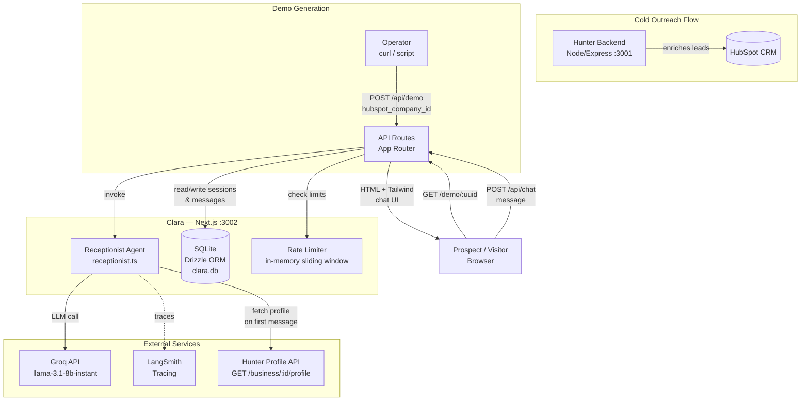

# Clara — AI Chat Receptionist for Local SMBs


Clara is a chat-based AI receptionist that turns Hunter-enriched business profiles into
personalized, live demo experiences. When a Hunter outreach email goes out with a demo link,
the prospect clicks through to a chat interface that already knows their business — its name,
services, hours, and contact details — before any setup work or sales call takes place.

**The problem it solves:** SMBs lose inbound leads around the clock because they cannot
respond in real time. Generic chatbots require hours of configuration the typical SMB owner
will never complete. Clara closes both gaps: it reads the business profile Hunter already
built, and it is live in under 30 seconds.

**v1 scope:** Operator-generated demo links for cold outreach. The prospect gets a
personalized experience; the operator tracks engagement. Live widget deployment and
self-serve onboarding are v2 features.

---

## Architecture



### Demo session lifecycle

1. Operator calls `POST /api/demo { hubspot_company_id }` — Clara creates a UUID session row and returns the link.
2. Operator pastes the link into a Hunter cold outreach email.
3. Prospect opens `/demo/{uuid}` — the chat UI renders.
4. On the first message, Clara fetches the business profile from Hunter (5 s timeout; falls back to "This Business" if unreachable). The profile is cached in the session row.
5. Clara builds a system prompt from the profile, prepends message history, calls Groq, and returns a reply.
6. Each message pair is stored in `chat_messages`. `message_count` is incremented on `demo_sessions`.
7. If the visitor triggers lead capture, their contact info is written to the `leads` table.

---

## Quick Start

**Prerequisites:** Node.js 20+, npm

```bash
cd clara
cp .env.example .env
# Edit .env — minimum required:
#   GROQ_API_KEY            — free at https://console.groq.com
#   HUNTER_API_URL          — URL of running Hunter backend (default: http://localhost:3001)
#   CLARA_OPERATOR_API_KEY  — generate with: openssl rand -base64 32

npm install
npm run db:migrate
npm run dev
# App running at http://localhost:3002
```

**Verify the setup:**

```bash
# Create a demo session (requires CLARA_OPERATOR_API_KEY in Authorization header)
curl -s -X POST http://localhost:3002/api/demo \
  -H "Content-Type: application/json" \
  -H "Authorization: Bearer <CLARA_OPERATOR_API_KEY>" \
  -d '{"hubspot_company_id": "123456"}' | jq .

# Expected response:
# { "sessionId": "<uuid>", "uuid": "<uuid>" }

# Open the demo in your browser
open http://localhost:3002/demo/<uuid>
```

> **Hunter dependency:** Clara fetches the business profile from `HUNTER_API_URL` on the first
> chat message. If Hunter is not running, Clara falls back to a generic "This Business" persona
> — it degrades gracefully rather than erroring.

---

## Project Structure

```
clara/
├── src/
│   ├── app/                          # Next.js 14 App Router
│   │   ├── api/
│   │   │   ├── admin/cleanup/        # POST — session expiry (operator-only)
│   │   │   ├── chat/route.ts         # POST send message, GET chat history
│   │   │   ├── demo/route.ts         # POST create session, GET session metadata
│   │   │   └── leads/               # POST capture lead, GET/DELETE leads (operator-only)
│   │   ├── demo/[uuid]/page.tsx      # Chat UI (client component, Tailwind)
│   │   ├── layout.tsx
│   │   └── page.tsx                  # Home / redirect to demo
│   ├── agent/
│   │   └── receptionist.ts           # Core agent: fetchBusinessProfile, buildSystemPrompt, runReceptionist
│   ├── db/
│   │   ├── index.ts                  # Drizzle + better-sqlite3 connection
│   │   ├── migrate.ts                # DDL migration runner
│   │   └── schema.ts                 # demo_sessions, chat_messages, leads tables
│   └── lib/
│       ├── auth.ts                   # requireOperatorAuth (timing-safe bearer check)
│       ├── rate-limit.ts             # In-memory sliding window limiter
│       └── startup.ts                # Production env var enforcement
├── .env.example
├── vitest.config.ts
├── tailwind.config.ts
└── next.config.ts
```

---

## Configuration

All environment variables are documented in `.env.example`. See [DEPLOYMENT.md](./DEPLOYMENT.md)
for the full reference with production requirements.

| Variable | Required | Default | Purpose |
|----------|:--------:|---------|---------|
| `GROQ_API_KEY` | Yes | — | Powers the chat LLM |
| `CLARA_OPERATOR_API_KEY` | Yes | — | Protects operator endpoints |
| `HUNTER_API_URL` | Yes | `http://localhost:3001` | Hunter backend for business profiles |
| `LANGSMITH_API_KEY` | Prod only | — | LLM observability tracing |
| `LANGSMITH_TRACING` | Prod only | `false` | Must be `"true"` in production |
| `HUNTER_API_KEY` | No | — | Bearer token if Hunter auth is enabled |
| `DATABASE_PATH` | No | `./clara.db` | SQLite file path |
| `GROQ_MODEL` | No | `llama-3.1-8b-instant` | Override the Groq model |
| `PORT` | No | `3002` | HTTP port |
| `NEXT_PUBLIC_BASE_URL` | Prod only | — | Full deployment URL |
| `NODE_ENV` | No | `development` | Environment; gates production startup checks |

---

## API Overview

Full reference: [API.md](./API.md)

| Method | Path | Auth | Purpose |
|--------|------|------|---------|
| `POST` | `/api/demo` | Operator | Create a demo session |
| `GET` | `/api/demo?uuid=` | Public | Get session metadata + increment view count |
| `POST` | `/api/chat` | Public | Send a message, get Clara's reply |
| `GET` | `/api/chat?sessionId=` | Public | Get full message history |
| `POST` | `/api/leads` | Public | Capture a visitor lead |
| `GET` | `/api/leads?company=` | Operator | List leads for a company |
| `DELETE` | `/api/leads/{id}` | Operator | Delete a lead (GDPR erasure) |
| `POST` | `/api/admin/cleanup` | Operator | Soft-delete sessions older than 30 days |

---

## Test Commands

```bash
# Run all tests (33 tests, Vitest)
npm run test

# Watch mode
npm run test:watch

# TypeScript check
npm run typecheck
```

No coverage gates — Explore phase. Tests cover the three core units: auth, rate limiting,
and the receptionist agent. See `src/__tests__/` for the full suite.

---

## Deployment

See [DEPLOYMENT.md](./DEPLOYMENT.md) for Railway deployment instructions.

**Key constraint:** SQLite requires a single-process host. Do not deploy to Vercel serverless
or any multi-instance environment in v1. Railway or Fly.io single-dyno with a persistent
volume are the correct targets.

---

## Runbook

Failure modes, diagnosis steps, and fixes: [RUNBOOK.md](./RUNBOOK.md)

---

## Security

Security scope, data handling, and vulnerability reporting: [SECURITY.md](./SECURITY.md)

---

## ADRs

| ADR | Decision |
|-----|---------|
| ADR-001 | SQLite for v1; Postgres migration required before v2 |
| ADR-002 | Single-node prompt chain over LangGraph for v1 |
| ADR-003 | Shared knowledgebase deferred to v2; Hunter profile API is the planned seam |
| ADR-004 | UUID-only session identity; no auth on demo pages |
| ADR-005 | In-memory rate limiting for v1 |
| ADR-006 | Lead capture in Clara DB only; no CRM write-back in v1 |
| ADR-0011 | `hubspot_company_id` as the universal identifier linking Clara to Hunter |
| ADR-0012 | Clara as standalone chat AI receptionist product |

Full ADR text: `.spec/architecture.md`

---

*Clara v0.1.0 — Explore phase — 2026-03-24*
